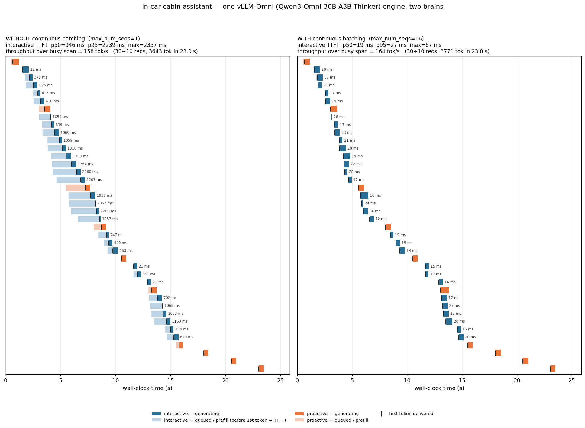
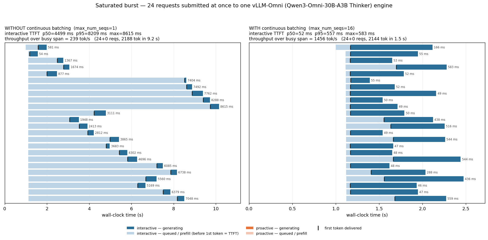

# Continuous Batching on vLLM-Omni —— 在 RTX 5090 上用 Qwen3-Omni-30B-A3B 跑出來的差異

> 對象：在車用 Blackwell-class 邊緣裝置上要落地的 Qwen-Omni 座艙助手 —— 單顆 GPU 上「主動偵測」與
> 「交互對話」兩個應用共用同一顆模型。本文用一台 **RTX 5090（Blackwell sm_120, 32 GB）** 實機跑出
> 「有 / 沒有 continuous batching」的差異，並對應到這兩個應用同時跑時的體驗。

---

## 0. TL;DR

- **vLLM-Omni 支援 continuous batching** —— 它把 omni 模型拆成多個 stage（Thinker / Talker / Code2Wav），
  每個自回歸（AR）stage 各跑一個標準 vLLM engine，而 continuous batching 就住在那個 AR scheduler 裡。
- 在這台 5090 上，把 Qwen3-Omni-30B-A3B 的 **Thinker** serve 起來，**唯一變數是 `max_num_seqs`**：
  `1` ＝「沒有 continuous batching」（一次只跑一條 request、排隊等），`16` ＝「有」。

| 情境 | 指標 | 沒有（`max_num_seqs=1`） | 有（`max_num_seqs=16`） | 倍數 |
|---|---|--:|--:|--:|
| **車艙情境**<br>主動偵測每 2.5s + 交互 Poisson ~1.6/s（共 30 交互 + 10 主動偵測） | 交互 TTFT p50 | **946 ms** | **19 ms** | **≈ 50×** |
| | 交互 TTFT p95 | 2 239 ms | 27 ms | **≈ 83×** |
| | 交互 TTFT 最差 | 2 357 ms | 67 ms | ≈ 35× |
| | 交互 端到端 p50 | 1 114 ms | 430 ms | ≈ 2.6× |
| | 主動偵測 端到端 最差 | 2 192 ms | 806 ms | ≈ 2.7× |
| **飽和爆量**<br>同一瞬間丟 24 個 request | 輸出吞吐（忙碌區間） | **239 tok/s** | **1 456 tok/s** | **≈ 6.1×** |
| | 24 個全部算完耗時 | 9.2 s | 1.5 s | ≈ 6.2× |
| | 交互 TTFT p50 | 4 499 ms | 52 ms | ≈ 87× |
| | 交互 TTFT 最差 | 8 615 ms | 583 ms | ≈ 15× |

*TTFT＝Time To First Token＝使用者按下說話到聽到第一個字的延遲。*

---

## 1. 背景：continuous batching 是什麼、為什麼重要

### 1.1 從推論的成本結構講起

LLM 推論分兩個階段：**prefill**（把 prompt 一次算完，得到第一個 token）和 **decode**（一次產生一個 token，
反覆做到 EoS）。decode 階段每產生一個 token，GPU 都要把**整顆模型的權重從 HBM 讀一遍**做矩陣乘法 ——
這一步是**記憶體頻寬瓶頸**（memory-bandwidth-bound）：算術量很小，但要搬的權重 bytes 很大。

關鍵觀察：**這一次權重讀，可以同時服務很多條序列。** 如果 batch 裡有 N 條 request 同時在 decode，
那一次把權重從 HBM 讀進來，就同時推進了 N 個 token —— 等於同樣的頻寬做了 N 倍的有效工作。
所以「把多條 request 併在一起算」對吞吐 / 省頻寬是巨大的槓桿。

### 1.2 Static batching vs Continuous batching

- **Static / 固定 batching**（最樸素的做法，等同 `model.generate([...])` 一次餵一批）：
  湊一批 N 條一起算，**全部算到完才能拿結果、才能收下一批**。問題：
  1. batch 裡有人輸出 5 個 token、有人輸出 500 個 → 短的那條早就算完了，卻得空轉等最長的那條（GPU 浪費、延遲爆炸）；
  2. 已經在跑的時候，新進來的 request 只能等下一批 → 高延遲；
  3. 為了等湊滿一批，要嘛等很久（延遲），要嘛 batch 沒滿就跑（吞吐差）。
- **Continuous / in-flight batching（vLLM 的做法）**：scheduler 在**每一個 decode step** 都重新排程 ——
  - 哪一條打到 EoS，**這個 step 結束就把它從 running batch 移除、結果立刻釋出**，不必等別人；
  - 哪一條新 request 進來（在 waiting queue），**下一個 step 就把它併進正在跑的 batch**，不必等下一批；
  - running batch 隨時動態地填到 `max_num_seqs` 那麼大 → GPU 一直滿載、權重讀一直被攤提到很多條。

  這就是你描述的：「同顆模型、不同時間點進來的 input 都能隨時 batch 在一起，拿一次權重後即可推論 → 極省頻寬；
  某個 prompt 算到 EoS 就釋出他的結果、下一個 input 隨時可進、不用等整批算完。」

### 1.3 為什麼這對「車艙助手」這類場景特別重要

這類車用 Qwen-Omni 座艙助手會同時跑（至少）兩種任務，**共用同一顆模型**：

- **「主動偵測」**：每隔幾秒看一張艙內 / 艙外的圖片（或場景），判斷要不要採取動作 ——
  調冷氣、關窗、提醒疲勞駕駛、播音樂…（輸出一段觀察 + 一行 function-call JSON + 理由）。**週期性、可預測。**
- **「交互對話」**：使用者**隨時**用語音問問題，要馬上得到回應。**對延遲敏感**（使用者在等）。

如果**沒有** continuous batching、兩種任務又共用一顆模型：主動偵測每 4 秒一輪、每輪 decode 要一兩秒以上，
那這一兩秒內進來的交互 request 只能**排在後面等**——使用者按下說話、卻要等主動偵測那一輪算完才開始有反應。
如果同時又來好幾個 request（多位乘客、追問），就一個一個排隊，最後那個等好幾秒。**這就是體驗問題。**

有了 continuous batching：交互 request 在主動偵測 decode 到一半時就**併進同一個 batch**，
~20 ms 就吐第一個字；主動偵測**完全不受影響**繼續跑；多個 request 一起進來就一起算（不是排隊）。

---

## 2. vLLM-Omni 支援 continuous batching 嗎？—— 支援

[vLLM-Omni](https://github.com/vllm-project/vllm-omni)（官方專案，本次用 v0.20.0）把 omni 模型拆成多個
**stage**，每個 stage 由不同型別的 engine 跑：

| Stage | 角色 | Engine 型別 |
|---|---|---|
| 0 Thinker | 多模態理解 + 文字生成（自回歸） | 標準 vLLM AR engine |
| 1 Talker | 文字 embedding → RVQ 語音碼（自回歸） | 標準 vLLM AR engine |
| 2 Code2Wav | RVQ 碼 → 音訊波形 | 一個輕量 causal ConvNet |

**continuous batching 就活在每個 AR stage 的 vLLM scheduler 裡**：
- `waiting` queue（新進來 / 被搶占的 request）、`running` queue（正在 decode 的）；
- 每個 step 呼叫一次 `schedule()` 重排 running batch；某條 seq 打到 EoS 就從 running queue 移除、釋出結果；
- `max_num_seqs` / `max_num_batched_tokens` 控批量上限（vLLM-Omni 的 stage deploy schema 裡 AR stage 的
  `max_num_seqs` 預設 64）。

所以「框架支不支援」這題的答案是**支援**；剩下的就是在 5090 上跑出來、量出差異。

---

## 3. 實驗環境

| 項目 | 值 |
|---|---|
| GPU | NVIDIA GeForce RTX 5090, Blackwell, **sm_120**, 32 GB |
| Driver / CUDA | 580.95 / driver 報 CUDA 13.0 |
| Python env | conda `vllm_omni`（Python 3.12） |
| 套件 | `vllm==0.20.0`（cu130 prebuilt wheel，**含 sm_120**，不需自己編 kernel）+ `vllm-omni==0.20.0`（純 Python plugin）+ matplotlib |
| 模型 | `Qwen3-Omni-30B-A3B-Instruct-AWQ-4bit`（compressed-tensors, pack-quantized int4, group_size 32；30B 總參數、每 token 只 active ~3B 的 MoE） |
| 服務方式 | `vllm serve <model> --max-num-seqs <N> --limit-mm-per-prompt '{"image":0,"video":0,"audio":0}' --skip-mm-profiling`（text-only），OpenAI 相容 API on `:8901` |
| 推論引擎內部數字 | Thinker 權重 ≈ 20 GB，KV cache ≈ 11 GB（≈ 120k tokens，≈ 14.6× 並發），CUDA graph 開 |

### 為什麼是「Thinker 經由 `vllm serve`」而不是完整 omni pipeline？

Qwen3-Omni-30B-A3B 的完整三段 pipeline（Thinker+Talker+Code2Wav）官方 deploy config 標明是在 **2× H100-80G**
上驗證的（stage 0 一張卡、stage 1+2 另一張卡）。三段全擠到單卡 32 GB 會 OOM —— Thinker 一個 stage 就吃 ~20 GB
權重，剩不到 ~10 GB 給 Talker + Code2Wav。而 **continuous batching 的行為完全活在 AR scheduler 裡，跟 audio
那兩段無關**。

剛好 plain `vllm serve <Qwen3-Omni 模型>` 會把 arch `Qwen3OmniMoeForConditionalGeneration` 映射到
`Qwen3OmniMoeThinkerForConditionalGeneration`（只出文字、不生音訊），所以只載 ~20 GB Thinker 權重、KV cache
拿滿 ~11 GB，單卡就放得下。**這個 Thinker AR engine 就是 vLLM-Omni stage-0 內部用的同一套 vLLM engine**，
所以這裡量到的 continuous batching 行為 ＝ 你在 vLLM-Omni 的 Thinker stage 會看到的行為。

> 安裝小坑（記錄給未來）：vLLM 0.20.0 的 PyPI wheel 是 **CUDA 13** build（需要 `torch==2.11.0+cu130`），
> 別用 `uv pip install ... --torch-backend=auto`（uv 只認到 cu128，會給 `torch==2.11.0+cu128`，造成
> `libcudart.so.13: cannot open shared object file`）；直接 `pip install "vllm==0.20.0"` 讓它解預設 PyPI 的
> `torch==2.11.0`（已是 cu13 build）即可。另外 torch 2.11 / sm_120 上 omni 的 multimodal *profiling* 路徑有個
> Triton codegen 小毛病，`--skip-mm-profiling` 可繞過（我們本來就只跑 text，不受影響）。

---

## 4. 實驗設計

整個實驗只有**一個變數**：server 啟動時的 `--max-num-seqs`。
- `max_num_seqs=1` ＝ **「沒有 continuous batching」**：vLLM 仍然是 iteration-level 排程，但 running batch 最多 1 條
  → request 排隊、FCFS、一個一個算到完才換下一個。這完全等同於最樸素的 `model.generate()` 一條一條跑的迴圈，
  是業界示範 continuous batching 價值的標準對照組。
- `max_num_seqs=16` ＝ **「有 continuous batching」**：running batch 隨時可填到 16 條。

兩個 config 各重啟一次 server，然後用同一支腳本（固定隨機種子 → 兩次的 request 到達時間完全一樣，比較才公平）
跑兩個情境：

### 情境 A：車艙情境（接近真實負載）—— 看「體驗 / 延遲」

`cabin_demo.py` 用 asyncio 同時跑兩條 request 流，**打同一個 engine**：
- **「主動偵測」流**：每 **2.5 秒**送一次，system prompt 要求輸出「【觀察】兩三句 + 【動作】一行 JSON +
  【理由】兩三句 + 【後續】一句」，最多 220 tokens（場景例如「駕駛連打三個噴嚏、車內 18°C、後排窗微開」）。
- **「交互對話」流**：以 **Poisson 過程（平均 ~1.6 次/秒）** 在隨機時間點送，使用者口語問句（路線、休息、關窗、
  四川話、副駕調溫…），最多 180 tokens。
- 送 request 的時間窗 24 秒，共產生約 30 個交互 + 10 個主動偵測 request。

每個 request 都記錄四個時間戳：
| 欄位 | 意義 |
|---|---|
| `t_submit` | 送出 request 的時間 |
| `t_first_token`（→ **TTFT** = `t_first_token − t_submit`） | 收到第一個 token —— **使用者「看到 / 聽到」反應的時刻** |
| `t_finish` | 收到 EoS、結果整段釋出的時刻（→ 端到端延遲 = `t_finish − t_submit`） |
| `n_out_tokens` | 產生的 token 數 |

`t_submit → t_first_token` 這段就是「**在 engine 裡排隊 + prefill、使用者還沒看到任何字**」的時間。
有沒有 continuous batching，差別主要就體現在這段。

### 情境 B：飽和爆量（saturated burst）—— 看「吞吐 / 省頻寬」

`cabin_demo.py --burst 24`：在同一瞬間丟 24 個 request（模擬「這一 tick 有一大堆東西要處理」），不跑主動偵測，
量「24 個全部算完要多久」「總輸出 tokens / 忙碌區間 ＝ 吞吐」以及每個 request 的 TTFT。
- 有 batching：24 個（最多 16 個同時）一起 decode，一次權重讀服務一大把 → 吞吐高、總耗時短、TTFT 都很小。
- 沒有 batching：24 個排隊、一個一個跑到完 → 吞吐 ＝ 單條速度、總耗時長、第 N 個的 TTFT ≈ 前 N−1 個的總算時。

---

## 5. 結果與怎麼看出差異

### 5.1 怎麼讀時間軸圖

兩張圖都是「左 ＝ 沒有 continuous batching、右 ＝ 有」並排，x 軸是 wall-clock 秒數，**一列一個 request**
（依送出順序由上到下）：
- **淺色** 段（`t_submit → t_first_token`）＝ 在 engine 裡**排隊 + prefill**，使用者**還沒看到任何字**（這段就是 TTFT）；
- **深色** 段（`t_first_token → t_finish`）＝ **正在吐 token / 串流回覆**；
- 黑色 **`|`** ＝ **第一個 token 送達**的那一刻；
- 橘色 ＝ 主動偵測 request，藍色 ＝ 交互 request；交互那列右邊標的 ms 數字 ＝ 它的 TTFT。

### 5.2 情境 A：車艙情境



**左邊（沒有 continuous batching, `max_num_seqs=1`）**：交互 request 普遍拖著一條很長的**淺色尾巴** ——
它們卡在 queue 裡等前面那個（常常是正在跑的主動偵測或前一個交互）算完，TTFT 中位數 **946 ms**、p95 **2.24 秒**、
最差 **2.36 秒**。連主動偵測自己也會被前面排隊的交互拖到，端到端最差 **2.19 秒**（正常 ~0.7 秒）。

**右邊（有 continuous batching, `max_num_seqs=16`）**：淺色尾巴幾乎看不到 —— 每個交互 request 在主動偵測（或別的
交互）decode 到一半時就**併進同一個 batch**，TTFT 中位數 **19 ms**、p95 **27 ms**、最差也只有 **67 ms**。
主動偵測完全不受影響、繼續按它的節奏跑（端到端最差 0.81 秒）。

| 指標 | 沒有（seqs=1） | 有（seqs=16） | 倍數 |
|---|--:|--:|--:|
| 交互 TTFT p50 | 946 ms | **19 ms** | **≈ 50×** |
| 交互 TTFT p95 | 2 239 ms | **27 ms** | **≈ 83×** |
| 交互 TTFT 最差 | 2 357 ms | 67 ms | ≈ 35× |
| 交互 端到端 p50 | 1 114 ms | 430 ms | ≈ 2.6× |
| 主動偵測 端到端 最差 | 2 192 ms | 806 ms | ≈ 2.7× |

> 注：這個負載沒把 GPU 餵滿（每 2.5s 一次主動偵測 + 稀疏的交互 burst），所以兩邊的「整段平均吞吐」差不多
> （158 vs 164 tok/s）—— 這個情境要看的是**延遲 / 體驗**，不是吞吐。吞吐的差異看情境 B。

#### log 對照（同樣的時刻，一個排隊、一個秒進）

**沒有 continuous batching** —— 交互 #5 送出後得等正在跑的主動偵測 #1 算完，**等了 1058 ms 才吐第一個字**：
```
[t=  3.80s] interactive #8  submitted
[t=  3.82s] interactive #9  submitted
[t=  4.07s] proactive   #1  DONE  (136 tok, e2e  1.07s, ...)   ← 主動偵測這一輪算完，queue 才輪到交互
[t=  4.09s] interactive #5  first token (waited   1058 ms after submit)
[t=  4.14s] interactive #5  DONE  ( 15 tok, e2e  1.11s, ...)
```

**有 continuous batching** —— 主動偵測 #1 還在跑（t=3.02 才吐第一個字），t=3.03 進來的交互 #5 **下一個 step 就併進去**，
26 ms 吐第一個字、t=3.15 就算完釋出；接著 #6 #7 也一樣秒進；主動偵測 #1 完全不受干擾，t=3.63 自己算完：
```
[t=  3.00s] proactive   #1  submitted
[t=  3.02s] proactive   #1  first token (waited     18 ms after submit)
[t=  3.03s] interactive #5  submitted               ← 在主動偵測 decode 到一半時進來
[t=  3.06s] interactive #5  first token (waited     26 ms after submit)   ← 直接併入正在跑的 batch
[t=  3.15s] interactive #5  DONE  ( 21 tok, e2e  0.12s, ...)              ← 打到 EoS 立刻釋出
[t=  3.32s] interactive #6  submitted
[t=  3.33s] interactive #6  first token (waited     17 ms after submit)
[t=  3.35s] interactive #7  submitted
[t=  3.38s] interactive #7  first token (waited     23 ms after submit)
[t=  3.63s] proactive   #1  DONE  (124 tok, e2e  0.63s, ...)             ← 主動偵測完全不受影響
```

### 5.3 情境 B：飽和爆量（24 個 request 同一瞬間進來）



（注意左右兩張圖的 x 軸刻度不一樣 —— 左邊到 ~10 秒，右邊到 ~2.5 秒。）

**左邊（沒有, seqs=1）**：一條**樓梯狀** —— 24 個 request 排隊，一個一個算到完才換下一個。第 1 個很快，但越後面
等越久，最後一個**等了 8.6 秒**才吐第一個字。24 個全部算完花 **9.2 秒**，輸出吞吐 **239 tok/s**（＝單條 decode 速度）。

**右邊（有, seqs=16）**：24 個 request **幾乎同時開跑**（t≈1.0s），一起 decode、一起串流，**1.5 秒**就全部算完。
輸出吞吐 **1 456 tok/s** —— 同樣的權重讀，現在一次服務一大把序列。TTFT 中位數 52 ms、最差 583 ms（後面 8 個排在前
16 個之後，但前面的一打到 EoS 它們馬上補上）。

| 指標 | 沒有（seqs=1） | 有（seqs=16） | 倍數 |
|---|--:|--:|--:|
| **輸出吞吐（忙碌區間）** | **239 tok/s** | **1 456 tok/s** | **≈ 6.1×** |
| 24 個全部算完耗時 | 9.16 s | 1.47 s | ≈ 6.2× |
| 交互 TTFT p50 | 4 499 ms | 52 ms | ≈ 87× |
| 交互 TTFT p95 | 8 209 ms | 557 ms | ≈ 15× |
| 交互 端到端 p50 | 4 923 ms | 819 ms | ≈ 6.0× |

---

## 6. 為什麼是這些倍數？

- **TTFT 改善（~50×、爆量時 ~87×）**：純粹來自**不用排隊**。沒有 continuous batching 時，新 request 必須等
  目前正在跑的那條（或前面排隊的那些）算到完；有的話，它下一個 decode step 就被併進正在跑的 batch，
  TTFT ≈ 一次 prefill（這顆模型的短 prompt prefill 只要 ~20 ms）。
- **吞吐 / 省頻寬改善（~6×）**：decode 是記憶體頻寬瓶頸 —— 每個 step 都要把整顆模型權重從 HBM 讀一遍。
  沒有 batching 時這一次讀只推進 1 個 token；batch 16 時同一次讀推進 16 個 token → 同樣的權重 bytes 做了
  約 6 倍的有效工作（239 → 1456 tok/s）。**這就是「省頻寬」的具體含義。**
- **為什麼不是 16×？** 因為 (1) batch 16 時模型已部分變成 compute-bound（每 step 的矩陣乘法量變大），
  per-seq 速度從 ~248 tok/s 掉到 ~145 tok/s；(2) 這顆 30B-A3B 是每 token 只 active ~3B 的 MoE，加上 AWQ 4-bit
  權重 + CUDA graph，**batch=1 的基準本來就已經很快**（~240 tok/s），所以 ratio 看起來「只有」~6×。
  換成更大、更密（非 MoE）、或更高精度的模型，這個倍數會更接近 batch size，因為 batch=1 時頻寬瓶頸更嚴重。
- **端到端延遲只改善 ~2.6×**（不像 TTFT 那麼誇張）：因為端到端 = TTFT + decode 時間，而 decode 時間在
  batch 大時 per-seq 反而略慢（多人分時間片）。對使用者體驗來說，**TTFT 才是「卡不卡」的關鍵**（按下說話多久聽到反應），
  TTFT 從 ~1 秒降到 ~20 ms 是體感上完全不同的兩件事。

---

## 7. 體驗是如何 —— 對應到車艙助手場景

把上面的數字翻成使用者視角：

| | 沒有 continuous batching | 有 continuous batching |
|---|---|---|
| 平常（主動偵測在跑，使用者插話問問題） | 按下說話 → **等 ~0.9 秒（最壞 ~2.4 秒）** 才開始有反應；因為交互的 request 卡在 queue 裡等主動偵測那一輪算完 | 按下說話 → **~20 ms 就開始回話**；交互的 request 直接併進主動偵測正在跑的 batch |
| 主動偵測會不會被拖慢 | 會 —— 前面排了交互 request 的話，主動偵測這一輪要等它們，端到端最差被拖到 ~2.2 秒（正常 ~0.7 秒）→ 「該關窗了」的動作延遲 | 不會 —— 主動偵測完全照自己的節奏跑（最差 0.81 秒） |
| 一下子來很多 request（多位乘客 / 連續追問 / 多支攝影機同時觸發） | 一個一個排隊，最後那個**等 4.5～8.6 秒** | 全部一起算，**~0.05 秒就都開始回**，1.5 秒內全部講完 |
| GPU 使用效率 / 頻寬 | 多數時間在等、權重讀只服務 1 條 → 同樣的功耗與頻寬做的事少 | 權重讀攤給一大把序列 → 同樣的功耗與頻寬做 ~6× 的事 |

一句話：**沒有 continuous batching，「主動偵測」和「交互對話」會互相卡 —— 主動偵測 4 秒一輪，交互的就得等那一輪；
有了它，兩者各跑各的、誰先算完誰先把結果交出去，使用者按下說話幾乎是即時回話，而且同一塊 GPU 能撐更多並發。**

---

## 8. 如何重現

```bash
cd vllm-omni-continuous-batching   # clone 後的目錄；先 `conda activate vllm_omni`

# 環境（一次性）
conda create -n vllm_omni python=3.12 -y
uv pip install --python ~/miniconda3/envs/vllm_omni/bin/python "vllm==0.20.0"      # cu130 prebuilt wheel（含 sm_120）
uv pip install --python ~/miniconda3/envs/vllm_omni/bin/python "vllm-omni==0.20.0" matplotlib
#  注意：不要加 `--torch-backend=auto`（會抓到 cu128 的 torch → libcudart.so.13 找不到）

# --- "沒有" config ---
MAX_NUM_SEQS=1  bash run_server.sh         # 等 logs/server_seqs1.log 出現 "Application startup complete"
python cabin_demo.py --config off       --max-num-seqs 1  --out results/run_off.json
python cabin_demo.py --config off_burst --max-num-seqs 1  --burst 24 --interactive-max-tokens 160 --out results/burst_off.json
pkill -f "vllm serve"

# --- "有" config ---
MAX_NUM_SEQS=16 bash run_server.sh
python cabin_demo.py --config on        --max-num-seqs 16 --out results/run_on.json
python cabin_demo.py --config on_burst  --max-num-seqs 16 --burst 24 --interactive-max-tokens 160 --out results/burst_on.json
pkill -f "vllm serve"

# --- 畫圖 + 列對比表 ---
python plot_timeline.py --off results/run_off.json   --on results/run_on.json   --out results/timeline_cabin.png
python plot_timeline.py --off results/burst_off.json --on results/burst_on.json --out results/timeline_burst.png \
    --title "Saturated burst — 24 requests submitted at once to one vLLM-Omni engine"

# --- (選用) 用 vLLM 內建 benchmark 跑 concurrency sweep ---
bash bench_sweep.sh    # server 起好後跑；再用 MAX_NUM_SEQS=1 起一次、再跑一次當 baseline
```

`cabin_demo.py` 主要參數：`--duration`、`--proactive-interval`、`--proactive-max-tokens`、`--interactive-rate`（Poisson req/s）、
`--interactive-max-tokens`、`--n-interactive`（上限）、`--burst N`（飽和模式）、`--seed`。

---

## 9. 限制與注意事項

- **完整 omni pipeline（含語音輸出）需要 ≥ 2 張 80 GB 等級的卡** —— 本文只示範 Thinker（AR 文字核心，
  也就是 continuous batching 真正住的地方）；audio 的 Talker / Code2Wav 不在 continuous-batching 這個題目的範圍內。
  （vLLM-Omni 0.20.0 本身在這台 5090 上**裝得起來、會載入**，只是三段擠單卡 32 GB 會 OOM。）
- **`max_num_seqs` 是 server 啟動時的參數** —— 兩個 config 要分別重啟 server；`cabin_demo.py --seed` 固定 →
  兩次 request 的到達時間一樣，比較才公平。
- **這台機器上其他程序也會搶 GPU**（如 ollama 的 `qwen3-vl:8b` 偶爾被觸發、會佔 ~26 GB）；server 起不來 OOM 時，
  先 `nvidia-smi --query-compute-apps` / `ollama ps` 看誰在佔。
- 數字是這顆特定模型（30B-A3B MoE, AWQ-4bit）在這台 5090 上的結果；換模型 / 量化 / GPU，**絕對值會變，但
  「有 continuous batching → TTFT 大幅下降、吞吐大幅上升」這個趨勢不變**（continuous batching 是 scheduler 的特性，與模型架構無關）。

---

*產出檔案見 `results/`（4 份逐 request JSON + 2 張時間軸 PNG）、`logs/`（各次 server 的完整 log，含 KV cache 大小、
並發上限等）。腳本見 `run_server.sh` / `cabin_demo.py` / `plot_timeline.py` / `bench_sweep.sh`。*
