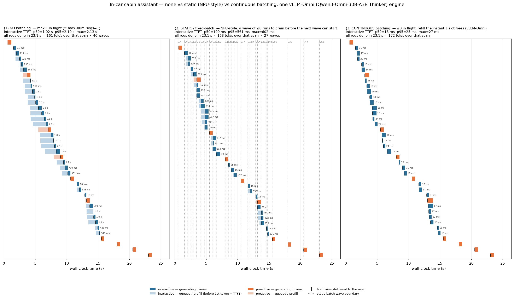
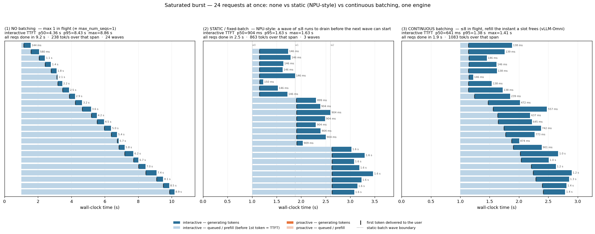

# 三種 request 排程方式的體驗對比 —— no batching / static (NPU 式) / continuous batching

> 在一台 **RTX 5090（Blackwell sm_120, 32 GB）** 上，用 **vLLM-Omni 0.20.0** serve **Qwen3-Omni-30B-A3B 的
> Thinker**，量出一個推論服務面對「陸續進來的 request 流」時，三種排程方式的體驗差異 —— 對應到車用座艙助手
> 「主動偵測」與「交互對話」兩個應用共用同一顆模型的情境。

---

## 0. TL;DR

同一顆模型、同一個 server、同一份負載（同一個隨機種子 → 三次的到達時間、每個 request 的取樣 seed 完全一樣），
唯一的變數是 **排程策略**。`B` = batch 大小上限（mode 1 等同 B=1，mode 2/3 取 B=8）。

**情境 A：車艙情境**（「主動偵測」每 2.5s 看一次場景 + 「交互對話」Poisson ~1.6/s 隨機進來，24 秒，共 30 交互 + 10 主動偵測）

| 指標 | (1) no batching `B=1` | (2) static / NPU 式 `B=8` | (3) continuous `B=8` |
|---|--:|--:|--:|
| 交互 TTFT p50 | **1 020 ms** | **199 ms** | **18 ms** |
| 交互 TTFT p95 | 2 096 ms | 561 ms | 25 ms |
| 交互 TTFT 最差 | 2 131 ms | 602 ms | 27 ms |
| 交互 在 client queue 排隊 p50 | 1 007 ms | 180 ms | 0 ms |
| 交互 端到端 p50 | 1 252 ms | 640 ms | 438 ms |
| 主動偵測 端到端 最差 | 1 985 ms | 1 132 ms | 888 ms |
| 形成的 batch「波」數 | 40（每次 1 條） | 27 | — |
| 相對 (3) 的倍數（TTFT p50） | **57×** | **11×** | 1× |

→ **`continuous` 把 `static` 再快 11 倍、把 `no batching` 快 57 倍**；`static` 介於兩者中間（拿到了「一波裡多條一起算」
的好處，但新 request 還是得等「上一波整批算完」才能進來）。

**情境 B：飽和爆量**（24 個 request 同一瞬間進來，各 ≤160 tokens）

| 指標 | (1) no batching `B=1` | (2) static `B=8` | (3) continuous `B=8` |
|---|--:|--:|--:|
| 交互 TTFT p50 | **4 359 ms** | **904 ms** | **641 ms** |
| 交互 TTFT 最差 | 8 857 ms | 1 626 ms | 1 412 ms |
| 24 個全部算完耗時 | **9.16 s** | **2.46 s** | **1.90 s** |
| 輸出吞吐（忙碌區間） | **238 tok/s** | **863 tok/s** | **1 083 tok/s** |

圖：[`results/timeline_3way.png`](results/timeline_3way.png)（車艙情境）、[`results/timeline_3way_burst.png`](results/timeline_3way_burst.png)（飽和爆量）。

---

## 1. 背景：一個推論服務面對「陸續進來的 request 流」的三種處理方式

LLM 推論分兩階段：**prefill**（把 prompt 一次算完、得到第一個 token）和 **decode**（一次產生一個 token、反覆做到
EoS）。decode 每產生一個 token，GPU 都要把**整顆模型權重從 HBM 讀一遍**做矩陣乘法——這是**記憶體頻寬瓶頸**：
算術量小、要搬的權重 bytes 大。**關鍵：這一次權重讀可以同時服務一整個 batch 裡的所有序列**——batch 裡有 N 條一起
decode，那一次權重讀就同時推進了 N 個 token。所以「把同時段的 request 併在一起算」對吞吐 / 省頻寬是巨大的槓桿；
而**何時能把一條 request 併進正在算的 batch**，就決定了它要等多久才聽到第一個字。據此分三種：

### (1) No batching（`max_num_seqs=1`）—— 最差
一次只算一條 request、FCFS 排隊。一條 request 到達時若引擎正在算別的，它就**從頭等到那條整個算完**。每一條都在
等前一條。權重讀只服務 1 條序列，GPU 多數時間在「為一條序列搬整顆模型」。這是最樸素的 `model.generate(單條)`
迴圈，也是這次的最差基準。

### (2) Static / 固定 batch（典型 NPU 為主、靜態圖的運算體驗）
湊一批（上限 B）一起送進去算。**這一批一旦開跑，形狀就定死了——跑中不能再加進新的 request**；某條先算到 EoS 的
結果可以先串流出來（那只是 detokenize / 收尾），但**它空出來的 slot 在這一批沒整個排空之前不能給別人用**；要等
整批排空，才會用 queue 裡累積的 request 湊出下一批。

這是很多 **NPU runtime、靜態 graph 編譯（TensorRT static engine 等）、以及不少邊緣裝置上的推論棧** 的真實情況：
batch 維度在編譯 / 啟動時就固定了，runtime 沒有「在第 k 步把第 N+1 條 request 塞進 batch」這種能力。所以它**拿到了
「一波裡多條一起算」的省頻寬好處（這比 (1) 好很多）**，但代價是：**一個在某一波算到一半時才到的 request，要等
那一整波排空才能開始**——按下說話到聽到反應，平均 ≈ 半個批～一個批的長度。它**夾在 (1) 與 (3) 中間**。

### (3) Continuous / in-flight batching（vLLM / vLLM-Omni 的做法）—— 我們提的
scheduler **每一個 decode step 都重新排程**：哪一條打到 EoS，這個 step 結束就把它移出 running batch、結果立刻釋出；
哪一條新 request 在 waiting queue 裡，**下一個 step 就把它併進正在算的 batch**；空出的 slot 立刻被等待中的 request
補上。running batch 隨時動態填到上限 B。→ 新 request ≈ 一個 prefill 就吐第一個字（不用等任何「批」），先算完的
立刻交還結果、下一個輸入隨時可進；同時 GPU 一直滿載、權重讀一直被攤提到很多條序列。

---

## 2. vLLM-Omni 支援 (3) —— 已確認

vLLM-Omni 把 omni 模型拆成多個 stage（Thinker / Talker / Code2Wav），每個自回歸（AR）stage 各跑一個**標準 vLLM
engine**；continuous batching 就住在那個 AR scheduler 裡：`waiting` / `running` queue、每 step 呼叫一次
`schedule()` 重排 running batch、某條打到 EoS 就從 running queue 移除釋出、`max_num_seqs` / `max_num_batched_tokens`
控批量上限（AR stage 預設 `max_num_seqs=64`）。官方專案 <https://github.com/vllm-project/vllm-omni>，文件
<https://docs.vllm.ai/projects/vllm-omni/>。

所以「框架支不支援 (3)」答案是**支援**。本文要做的是把 (1)/(2)/(3) 三者在同一台機器上跑出來、量出體驗差。

---

## 3. 實驗設定

| 項目 | 值 |
|---|---|
| GPU | NVIDIA GeForce RTX 5090, Blackwell, **sm_120**, 32 GB |
| 環境 | conda `vllm_omni`（Python 3.12）；`vllm==0.20.0`（cu130 prebuilt wheel，含 sm_120，不需自己編 kernel）+ `vllm-omni==0.20.0` |
| 模型 | `cpatonn/Qwen3-Omni-30B-A3B-Instruct-AWQ-4bit`（HF；compressed-tensors, int4, group_size 32；30B 總參數、每 token 只 active ~3B 的 MoE） |
| 服務 | `vllm serve <model> --max-num-seqs 32 --limit-mm-per-prompt '{"image":0,"video":0,"audio":0}' --skip-mm-profiling`（text-only）；OpenAI 相容 API on `:8901`。plain `vllm serve` 會把 `Qwen3OmniMoeForConditionalGeneration` 映射成只出文字的 **Thinker** → 只載 ~20 GB 權重、KV cache 拿滿 ~11 GB（≈ 120k tokens）。這個 Thinker AR engine 就是 vLLM-Omni stage-0 內部用的同一套 vLLM engine。 |

**三種模式怎麼跑（同一個 server，差異全做在 client 端的「進場 / 補位規則」）：**
vLLM 的 V1 engine 永遠是 continuous batching、沒有「靜態 batch」開關。所以我們把 server 用一個夠大的
`max_num_seqs=32` 起起來（不會是瓶頸），三種模式都是 **client 端的 admission controller**——這樣三者唯一的變數就是
排程策略，模型 / server / 負載 / 每個 request 的取樣 seed 完全一致：

| mode | 同時在跑的上限 | 補位規則（某條算完、空出 slot 後） |
|---|--:|---|
| `none` | 1 | 等這 1 條算完，才送下一條（≡ `max_num_seqs=1` 的 server） |
| `static` (B=8) | 8 | 這一波 ≤8 條**全部排空**（in-flight→0）後，才從 queue 取下一波 ≤8 條；波進行中新 request 一律等 |
| `continuous` (B=8) | 8 | 任一條算完、in-flight<8 的瞬間，**立刻**從 queue 補一條進來（≡ vLLM continuous batching, cap 8） |

每個 request 記：`t_submit`（到達 / 進 client queue）、`t_admitted`（離開 queue、實際開始）、`t_first_token`
（→ TTFT = first_token − submit，含 client 排隊 + server prefill）、`t_finish`（EoS、結果整段釋出）、`wave_id`
（屬第幾波，static 模式）。負載：proactive 每 2.5s（≤220 tok）、interactive Poisson ~1.6/s（≤180 tok）、24 秒窗；
另有飽和爆量（24 條一瞬間進來，各 ≤160 tok）。三種模式各跑一次，同一個 `--seed`。

**這個 emulation 公不公平 / 忠實嗎？**
- mode (1) / (3) **完全重現**真實 `max_num_seqs=1` / `=B` server 的行為 —— cross-check：先前用真實 `max_num_seqs=1`
  server 跑同樣負載得交互 TTFT p50 **946 ms**（這次 emulated `none` 得 1 020 ms，同量級、差異來自 run-to-run 與
  seeded vs 非 seeded 的輸出長度抖動）；真實 `max_num_seqs=16` server 得 **19 ms**（這次 emulated `continuous` B=8
  得 18 ms，幾乎一樣——本負載下引擎一直有空 slot，補位的網路 RTT 直接算進 prefill 量測裡，可忽略）。見附錄。
- mode (2) 是 NPU 為主 / 靜態圖的合理模型。emulation 唯一**對 mode (2) 偏寬鬆**的兩處：(a) vLLM 在底下會把跑中的
  batch 隨 seq 結束**縮小**，所以不浪費算力、且這一波最長那條的尾段會稍快（真實靜態 batch 會把 batch 維持在 B、
  長尾那條全程慢速）；(b) 我們用最寬鬆的「引擎一空就把 queue 裡的人湊一波開跑」，沒有額外「等湊滿 B 或 timeout」
  的批集延遲。→ 量到的 mode (2) 延遲是「真實 NPU 停頓」的**下界**；質性上「整批算完才放下一批」忠實。

---

## 4. 結果與怎麼看出差異

### 4.1 怎麼讀時間軸圖

三個 panel 並排（(1) no batching / (2) static / (3) continuous），x 軸是 wall-clock 秒、一列一個 request（依到達順序）：
- **淺色**段 `t_submit → t_first_token` ＝ 在 queue 裡排隊 + prefill，使用者**還沒看到任何字**（這段長度就是 TTFT）；
- **深色**段 `t_first_token → t_finish` ＝ **正在吐 token / 串流回覆**；
- 黑色 **`|`** ＝ 第一個 token 送達；橘色 ＝ 主動偵測 request、藍色 ＝ 交互 request；
- (2) static panel 的**淡色虛線** ＝ 一個「波」的開始（`w0`、`w1`、…）；交互那列右邊的 ms / s ＝ 它的 TTFT。

### 4.2 情境 A：車艙情境



- **(1) no batching**：每個交互 request 拖著一條很長的淺色尾巴——它卡在 queue 裡等前面那個（常是正在算的主動偵測或
  前一個交互）整個算完。TTFT 中位數 **1.02 秒**、p95 **2.10 秒**、最差 **2.13 秒**。連主動偵測自己也被前面排隊的交互
  拖到，端到端最差 **1.99 秒**（正常 ~0.65 秒）。
- **(2) static (B=8)**：bar 都從某條淡色虛線（波界）開始——一個在某波算到一半時才到的 request，要等那一整波排空才被
  湊進下一波。它**拿到了「一波多條一起算」的好處**（一波 ≤8 條同時 decode，所以比 (1) 快很多），但 TTFT 仍被「等上一波
  排空」墊高：中位數 **199 ms**、p95 **561 ms**、最差 **602 ms**。比 (1) 快 ~11 倍，但比 (3) 慢 ~11 倍。
- **(3) continuous (B=8)**：淺色尾巴幾乎看不到——交互 request 在主動偵測（或別的交互）算到一半時就**併進同一個
  batch**，TTFT 中位數 **18 ms**、p95 **25 ms**、最差 **27 ms**；主動偵測完全不受影響繼續跑（端到端最差 0.89 秒）。

#### log 對照（同一個時刻，三種行為）

**(2) static** —— t=3.47s 形成 wave #5（4 條）；interactive #5 在 queue 裡等了 440 ms、#6 等 156 ms、#7 等 119 ms，
它們**一起在波界開始**（連一個主動偵測 #1 也被卡在這個波界等了 471 ms）：
```
[t=  3.35s] interactive #7  arrived    (pending 4, in-flight 1)        ← 此刻 wave #4 還在跑，#7 不能加入
[t=  3.47s] interactive #4  DONE  (138 tok, ...)                       ← wave #4 整個排空
[t=  3.47s] --- wave #5: admitting 4 req (pending was 4) ---           ← 才湊出下一波
[t=  3.47s] proactive   #1  admitted   (waited    471 ms in client queue, wave #5)
[t=  3.47s] interactive #5  admitted   (waited    440 ms in client queue, wave #5)
[t=  3.47s] interactive #6  admitted   (waited    156 ms in client queue, wave #5)
[t=  3.47s] interactive #7  admitted   (waited    119 ms in client queue, wave #5)
[t=  3.49s] interactive #7  first token (TTFT    140 ms = 119 queue + 21 prefill)
```

**(3) continuous** —— 同一個負載的同一個時刻：主動偵測 #1 還在跑（t=3.02 才吐第一個字），t=3.03 進來的 interactive #5
**下一個 step 就被併進去**，25 ms 吐第一個字、t=3.30 就算完釋出；#6、#7 同樣秒進；主動偵測 #1 完全不受干擾，t=3.73 自己算完：
```
[t=  3.02s] proactive   #1  first token (TTFT     15 ms = 0 queue + 15 prefill)
[t=  3.03s] interactive #5  arrived    (pending 1, in-flight 2)
[t=  3.03s] interactive #5  admitted   (waited      0 ms in client queue)   ← 直接併入正在跑的 batch
[t=  3.06s] interactive #5  first token (TTFT     25 ms = 0 queue + 25 prefill)
[t=  3.30s] interactive #5  DONE  ( 51 tok, e2e  0.27s, ...)                ← 打到 EoS 立刻釋出
[t=  3.33s] interactive #6  first token (TTFT     16 ms = 0 queue + 16 prefill)
[t=  3.37s] interactive #7  first token (TTFT     20 ms = 0 queue + 20 prefill)
[t=  3.73s] proactive   #1  DONE  (137 tok, e2e  0.73s, ...)                ← 主動偵測完全不受影響
```

**(1) no batching** —— interactive #11 在 queue 裡等了 **1800 ms**（卡在 #10 後面，#10 跑到 t=6.02 才結束），TTFT 1812 ms：
```
[t=  6.02s] interactive #10 DONE  (135 tok, e2e  1.84s, ...)
[t=  6.02s] interactive #11 admitted   (waited   1800 ms in client queue, wave #13)
[t=  6.03s] interactive #11 first token (TTFT   1812 ms = 1800 queue + 12 prefill)
```

### 4.3 情境 B：飽和爆量（24 條一瞬間進來）



（三個 panel 的 x 軸刻度不同 —— (1) 到 ~10 秒、(2)(3) 到 ~3 秒。）

- **(1) no batching**：一條樓梯——24 條排隊、一個一個算到完。第 1 個快、越後面等越久，最後一個**等了 8.86 秒**才吐第一個字；
  24 個全部算完花 **9.16 秒**；輸出吞吐 **238 tok/s**（＝單條 decode 速度）。
- **(2) static (B=8)**：3 個波（圖上 `w0`/`w1`/`w2` 三道虛線）——8 條一波一起算、整批排空才開下一波。波 0 的 TTFT ≈ 一個
  8-way prefill（~0.6 秒），波 1 還要再加「等波 0 排空」（~0.9 秒），波 2 再加一層（~1.6 秒）；24 個全部算完 **2.46 秒**；
  吞吐 **863 tok/s**（≈ 單條的 3.6×）。
- **(3) continuous (B=8)**：8 條先開跑，**任一條打到 EoS 就立刻補一條**進來——所以短的（如那句四川話 ~15 tokens）一算完，
  排隊中的下一條馬上接上。TTFT p50 **641 ms**、最差 **1.41 秒**；24 個全部算完 **1.90 秒**；吞吐 **1 083 tok/s**（≈ 單條的 4.5×）。

> 在這個 B=8 + 24 條短 request 的爆量下，(2) 與 (3) 兩者都被「上限只能同時跑 8 條」這個 capacity 卡住，所以差距比情境 A 小
> （(3) 仍勝在「空出的 slot 立刻補位」而不是「整波排空才補」，省了那些被早早算完、卻空著等整波的 slot）。把 B 調小（如 B=4）
> 或讓輸出長度更分散，(2)→(3) 的差距會再拉大。

---

## 5. 體驗 mode by mode（對應車艙助手場景）

| | (1) no batching | (2) static / NPU 式 | (3) continuous |
|---|---|---|---|
| 平常（主動偵測在跑，使用者插話問問題） | 按下說話 → **等 ~1 秒（最壞 ~2.1 秒）** 才開始有反應；交互的 request 從頭等主動偵測那一輪算完 | 按下說話 → **等 ~0.2 秒（最壞 ~0.6 秒）**；交互的 request 卡在「上一批還沒算完」的批界停頓 | 按下說話 → **~20 ms 就開始回話**；交互的 request 下一個 step 就併進正在跑的 batch |
| 一下子來很多 request（多位乘客 / 連續追問 / 多攝影機同時觸發 24 件事） | 一個一個排隊，最後那個**等 ~8.9 秒**；全部處理完 ~9.2 秒 | 8 條一波、3 波；最後那個**等 ~1.6 秒**；全部處理完 ~2.5 秒 | 8 條開跑、算完一個補一個；最後那個**等 ~1.4 秒**；全部處理完 ~1.9 秒 |
| 主動偵測會不會被拖慢 | 會——前面排了交互就得等它們，端到端最差 ~2 秒（正常 ~0.65 秒）→「該關窗了」的動作延遲 | 會一點——也被卡在批界，端到端最差 ~1.1 秒 | 幾乎不會——照自己節奏跑，端到端最差 ~0.9 秒 |
| GPU 頻寬效率（飽和時的吞吐） | ~238 tok/s（權重讀只服務 1 條） | ~863 tok/s（一波 8 條攤提） | ~1 083 tok/s（隨時填滿、攤提到最多） |

一句話：
- **沒有 batching**：主動偵測跑一輪、交互就得從頭等那一輪；多件事就一個一個來——體驗最差，GPU 也最浪費。
- **靜態 / 固定 batch（很多 NPU runtime 的現況）**：拿到了「一波多條一起算」的省頻寬好處，比沒 batching 好很多；但
  「跑中不能再加進來」這個限制，讓新到的 request 卡在「上一批還沒算完」的批界停頓——按下說話到聽到反應 ≈ 半批～一批的長度。
- **continuous batching（vLLM-Omni 的做法）**：每個 step 都能吃新進來的 request、誰先算完誰先把結果交出去——交互 ~即時回話、
  主動偵測互不干擾，而且 GPU 一直滿載、吞吐最高。

---

## 6. 為什麼是這些數字

- **TTFT 改善**：(1)→(2) 來自「不用從頭等前一條，而是搭上一波一起算」；(2)→(3) 來自「不用等整批排空才被湊進下一波，
  下一個 step 就能加入」。在我們的車艙負載下：(1) 的等待 ≈ 前一條的剩餘時間（~1 秒）；(2) ≈ 當前波排空的剩餘時間
  （~0.2 秒，波不大）；(3) ≈ 一個 prefill（~20 ms）。
- **吞吐 / 省頻寬改善**（飽和爆量）：238 → 863 → 1083 tok/s。decode 是頻寬瓶頸，一次權重讀同時推進整個 batch；(1) 每次只
  推 1 個 token、(2)/(3) 每次推一整波。倍數沒到「等於 batch size」是因為 batch 大時模型已部分變成 compute-bound（per-seq
  速度從 ~248 掉到 ~170 tok/s），加上這顆 30B-A3B（每 token 只 active ~3B、AWQ 4-bit、CUDA graph）batch=1 的基準本來就快。
- **為何 mode (2) 在我們這台上「只有」這麼大差距**：decode 太快、B 只取 8、且我們的 emulation 對 mode (2) 偏寬鬆
  （見 §3）。在真實 NPU 上（batch 維度定死、長尾全程慢速、可能還要等湊滿 batch），mode (2) 的停頓會明顯更嚴重。

---

## 7. 如何重現

```bash
cd vllm-omni-continuous-batching   # clone 後的目錄；先 `conda activate vllm_omni`

# 環境（一次性）
conda create -n vllm_omni python=3.12 -y
pip install "vllm==0.20.0"        # cu130 prebuilt wheel（含 sm_120）；不要加 uv 的 --torch-backend=auto（會抓到 cu128 的 torch → libcudart.so.13 找不到）
pip install "vllm-omni==0.20.0" matplotlib

# 1) 起一個夠大的 server（modes 都在 client 端 emulate，server 不是瓶頸）
MAX_NUM_SEQS=32 bash run_server.sh           # 等 logs/server_seqs32.log 出現 "Application startup complete"

# 2) 車艙情境（同一個 --seed → 三次到達時間/取樣完全一樣）
python cabin_demo.py --mode none       --batch-size 1 --max-num-seqs 32 --out results/run_none.json
python cabin_demo.py --mode static     --batch-size 8 --max-num-seqs 32 --out results/run_static.json
python cabin_demo.py --mode continuous --batch-size 8 --max-num-seqs 32 --out results/run_continuous.json

# 3) 飽和爆量（24 條一瞬間進來）
for m in none static continuous; do B=8; [ "$m" = none ] && B=1; \
  python cabin_demo.py --mode $m --batch-size $B --max-num-seqs 32 --burst 24 --interactive-max-tokens 160 --out results/burst_$m.json; done

# 4) 畫圖 + 列三欄表
python plot_timeline.py --panels results/run_none.json results/run_static.json results/run_continuous.json --out results/timeline_3way.png
python plot_timeline.py --panels results/burst_none.json results/burst_static.json results/burst_continuous.json --out results/timeline_3way_burst.png
```

`cabin_demo.py` 主要參數：`--mode {none,static,continuous}`、`--batch-size B`、`--duration`、`--proactive-interval`、
`--proactive-max-tokens`、`--interactive-rate`（Poisson req/s）、`--interactive-max-tokens`、`--n-interactive`、
`--burst N`（飽和模式：N 條一次到達、不跑主動偵測）、`--seed`。

---

## 8. 限制與注意事項

- 完整 omni pipeline（含語音輸出 Talker + Code2Wav）官方 deploy config 是在 **2× H100-80G** 上驗證的；單卡 32 GB
  放不下三段，所以本文只示範 **Thinker**（AR 文字核心，也就是 continuous batching 真正住的地方）。
- mode (2)「static」是 NPU 為主 / 靜態圖的**合理模型**，emulation 對它偏寬鬆（見 §3）→ 量到的差距是下界；要做更「純」的
  版本可用 offline `LLMEngine.step()`（自己 `add_request` 控制批的形成）。
- mode (3)「continuous」用 client 端 cap=B emulate（補位多一個 ~ms 級網路 RTT）；cross-check 對真實 `max_num_seqs` server
  的數字幾乎一樣（見附錄）。
- 數字是這顆模型（30B-A3B MoE, AWQ-4bit）在這台 5090、這份負載下的結果；換模型 / 量化 / GPU / 負載，**絕對值會變，
  但「no batching < static < continuous」的順序與「TTFT 大幅下降、吞吐大幅上升」的趨勢不變**——continuous batching 是
  scheduler 的特性，與模型架構無關。
- server 跑起來佔 ~30 GB GPU；用完 `pkill -f "vllm serve"`。這台機器上其他程序（如 ollama）也可能搶 GPU，server 起不來
  OOM 時先 `nvidia-smi --query-compute-apps`。

---

## 附錄：emulation 對真實 server 的 cross-check（第一階段資料）

第一階段直接用真實的 `vllm serve --max-num-seqs N` 跑過同樣的車艙負載：

| | 真實 server | 對應本文 emulated 模式 |
|---|--:|---|
| `max_num_seqs=1`（真 FCFS）→ 交互 TTFT p50 | **946 ms** | `none`：1 020 ms ✓ 同量級 |
| `max_num_seqs=16`（真 continuous）→ 交互 TTFT p50 | **19 ms** | `continuous` (B=8)：18 ms ✓ 幾乎一樣 |

也就是說 client 端的 admission emulation 在 (1) 與 (3) 兩端與真實 server 對得上；(2)「static」沒有對應的 server flag
（vLLM V1 永遠 continuous），是用「同 server + client 端不在波結束前送下一條」忠實還原 NPU 式的固定批行為。

*產出檔案：`results/run_{none,static,continuous}.json`、`results/burst_{none,static,continuous}.json`（逐 request 資料 +
summary）、`results/timeline_3way.png`、`results/timeline_3way_burst.png`；`logs/server_seqs32.log`（server 完整 log）。
腳本：`run_server.sh` / `cabin_demo.py` / `plot_timeline.py` / `bench_sweep.sh`。*
