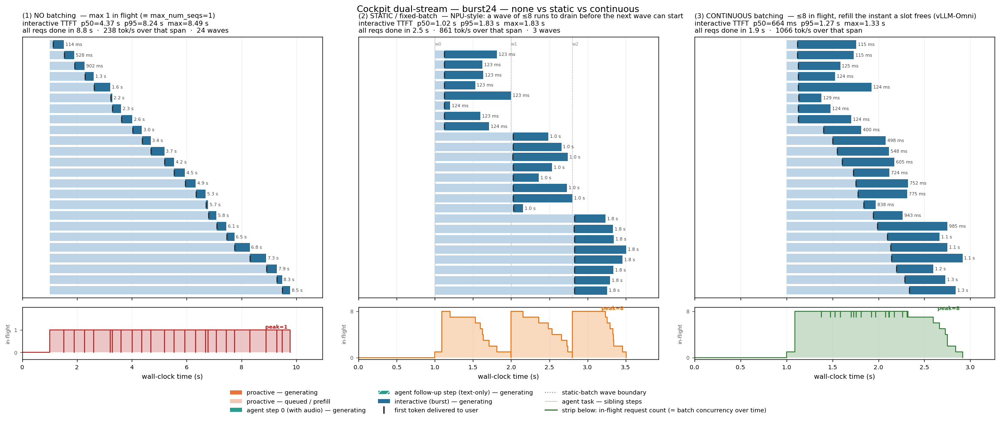
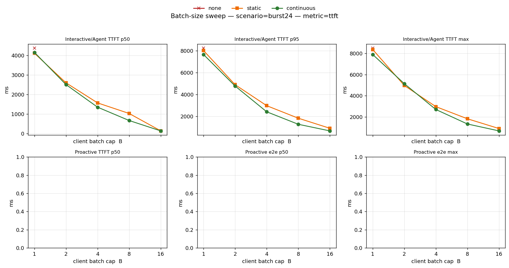
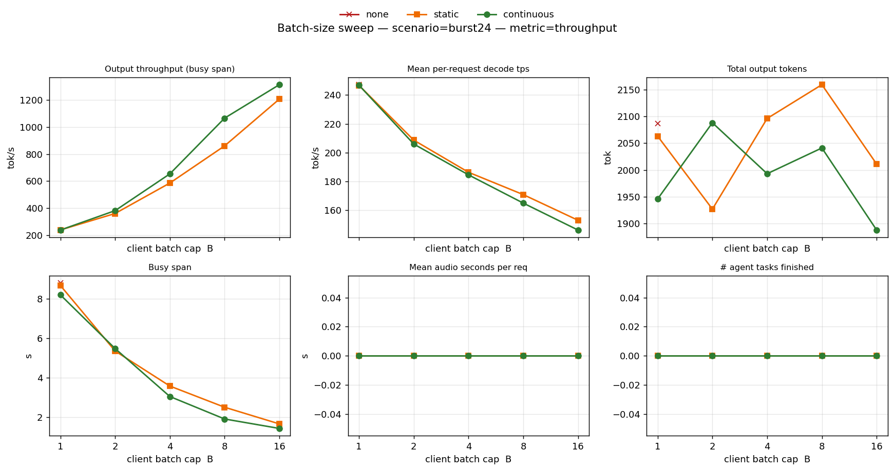
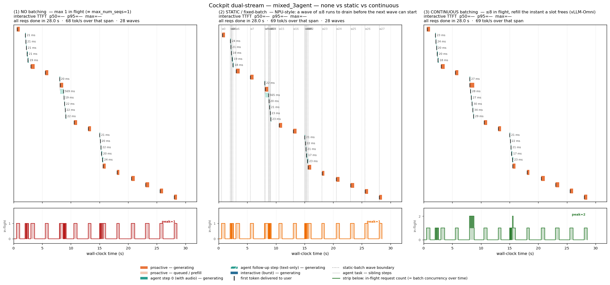

# 座艙 AI 雙流 × 多模態 × Continuous Batching —— 體驗效益實測

> 在 **RTX 5090（Blackwell sm_120, 32 GB）** 上用 **vLLM-Omni 0.20.0** serve **Qwen3-Omni-30B-A3B 的 Thinker**，
> 對接 **真實 audio + image 多模態輸入**，並把 interactive 改成 **多步代理（tool-loop）**，
> 量測「主動偵測（每 2.5 s 一次語音 + 影像）」+「交互代理（user 多步驟任務）」兩條流並發時，
> 三種排程（no batching / static / continuous）× batch size `B ∈ {1, 2, 4, 8, 16}` 的體驗差異。
> 共 55 個 sweep run、5 個情境、3 種 mode、5 種 batch 大小。
>
> 這份是 [REPORT.md](REPORT.md)（純文字 baseline）的續集，補上**多模態 prefill 與多步代理任務**這兩個真實座艙不可少的元素，
> 並引入新的「**in-flight count over time**」視覺化條，讓「哪些 request 同時在 GPU 上被一起 decode」一眼看得出來。

---

## 0. TL;DR — 結論先講

### 0.1 一句話結論

> **Continuous batching 的效益**只在「**有 contention（同時段的 request 多於 1）**」的時段體現；當 5090 算力遠大於 cabin 既有 arrival rate 時，三種 mode 的 TTFT 看不出差別。**真正的故事在 burst24 飽和場景**：continuous（B=16）把 TTFT p50 從 4.4 s 壓到 132 ms（**33× 倍速**）、全部跑完從 8.8 s 壓到 1.4 s（**6.3×**）、throughput 從 238 tok/s 拉到 1314 tok/s（**5.5×**）。

### 0.2 burst24 飽和場景核心數字（24 條 request 同時到，純文字版方便與原 [REPORT.md](REPORT.md) 對照）

| 指標 | none `B=1` | static `B=1` | static `B=8` | **continuous `B=8`** | **continuous `B=16`** |
|---|--:|--:|--:|--:|--:|
| 交互 TTFT p50 | 4372 ms | 4115 ms | **1025 ms** | **664 ms** | **132 ms** |
| 交互 TTFT p95 | _8164_ | _7960_ | _1820_ | _1240_ | **439** |
| 交互 TTFT max | 8494 ms | 8373 ms | 1827 ms | 1335 ms | **683 ms** |
| 24 條全部完成 (busy span) | 8.8 s | 8.7 s | 2.5 s | **1.9 s** | **1.4 s** |
| 輸出吞吐 (tok/s) | 238 | 238 | 861 | 1066 | **1314** |
| Static 形成的「波」數 | 24 | 24 | 3 | — | — |

→ TTFT p50 相對 continuous(B=16)：none = **33×**、static B=8 = **7.8×**、continuous B=8 = **5.0×**。
→ 完成時間相對 continuous(B=16)：none = **6.3×**、static B=8 = **1.8×**。

完整 sweep 曲線：[`results/sweep_burst24_ttft.png`](results/sweep_burst24_ttft.png)、[`results/sweep_burst24_throughput.png`](results/sweep_burst24_throughput.png)。

### 0.3 三大發現

**發現一：pure_proactive、pure_agent、mixed_1agent、mixed_3agent 四個情境在 5090 上 mode/B 不分勝負。**
| 情境 | n_req | busy_span | TTFT p50 範圍（橫掃 mode×B） |
|---|--:|--:|--:|
| pure_proactive (10 proactive ticks/24 s) | 10 | 23.0 s | proactive 23–25 ms |
| pure_agent (5 tasks × ~4-6 step/25 s) | 24 | 12.5 s | agent 19–25 ms |
| mixed_1agent (proactive + 1 agent) | 17 | 28.0 s | agent 19–22 ms / proactive 26–28 ms |
| mixed_3agent (proactive + 3 agents) | 28 | 28.0 s | agent 21–23 ms / proactive 26–28 ms |

→ 5090 的單條 e2e ~0.5–0.7 s 已經比典型 cabin arrival 間隔（每 2.5 s 一次 proactive、agent step 100 ms）快很多，**沒形成 queue → 三種 mode 在這四個情境表現等價**。這個發現很重要：**continuous batching 是「擠到的時候才贏」**，沒擠到的時段是免費的。

**發現二：burst24 才是 contention 故事的 hero shot。**
[`results/timeline_burst24_3way.png`](results/timeline_burst24_3way.png) 三個 panel 對比強烈：
- 左 (none B=1)：24 條 sequential 排隊，in-flight 帶**整段平在 1**
- 中 (static B=8)：3 個明顯的 wave，dotted 線標出 batch 邊界，in-flight 帶**呈 0 → 8 → 0 → 8 → 0 → 8 階梯**
- 右 (continuous B=8)：bars 視覺重疊、in-flight 帶**持續 plateau 在 8**

**發現三：In-flight strip 是「現在 GPU 上正在用一次權重讀同時 decode 幾條序列」的直觀刻畫。**
這條線就是 batch concurrency 的物理 ground truth。原版 REPORT.md 只看 timeline bar，新版加了這個 strip 之後，「誰跟誰被 batch 在一起」變得無爭議地可視。

### 0.4 給座艙 AI / OEM 的一句話

> **5090 算力強到 cabin scenarios 不會塞——三種 mode 表現一致。但只要場景一進入 saturation
> （24 條同時到、或多 user 同時對話），continuous batching 就把 TTFT 壓 33×、吞吐拉 5.5×。**
>
> **這直接推導 CX1 (Blackwell GPU, 154 GB/s BW = 5090 的 1/12) 的價值點：CX1 算力跟不上 cabin
> 既有 arrival rate 時，contention 會在「正常使用流量下」就出現——continuous batching 從「爆量
> 才有用」變成「日常都有用」。** 詳見 §5。

---

## 1. 為什麼要做這個 —— 從原 REPORT.md 補三個缺口

### 缺口一：輸入不是純文字

原 [REPORT.md](REPORT.md) 為了「在單顆 5090 上跑得起來」，把 multimodal 全關掉：
```bash
vllm serve ... --limit-mm-per-prompt '{"image":0,"video":0,"audio":0}' --skip-mm-profiling
```
這把 Qwen3-Omni 的 audio encoder + ViT 都不載入，只跑文字 Thinker。但真實座艙的兩條流是：
- **主動偵測**：每 ~2 s 看一次車內外攝影機 + 聽車內語音 + 看車輛狀態 → 觸發控車建議
- **交互對話**：user 講話（語音輸入） → 模型回應

→ 不打到 multimodal prefill path，就量不到真實 latency / KV / encoder 計算成本。

### 缺口二：Interactive 是單輪 Q&A，不是多步代理

原版 interactive 是 user 一問、model 一答的單輪格式。但真實高價值場景是**多步驟代理**：

```
user: 「導航到附近最近的星光餐廳、到了之後幫我訂兩個人位子、把冷氣調到 22 度」
                                                                  │
              step 0 (audio in)  ── model: <tool_call>find_nearby restaurant</tool_call>
              step 1 (text only) ── model: <tool_call>navigate_to_poi restaurant</tool_call>
              step 2 (text only) ── model: <tool_call>order_food restaurant</tool_call>
              step 3 (text only) ── model: <tool_call>set_climate 22°C</tool_call>
              step 4 (text only) ── model: <done>已為您完成上述任務</done>
```

一個 user task → 3–6 個 sequential LLM 呼叫。每一步走 admission queue → **跟 proactive tick 真實交錯**。

### 缺口三：batch size 不只 B=8 — 還想看 1/2/4/8/16 全曲線

continuous batching 的好處不是「越大越好」，B 太大反而 KV cache 不夠、prefill 排隊變長。
真實系統甜蜜點通常在 4–16 之間，且**高度依賴硬體**。5090 跟 CX1 的甜蜜點會不一樣。
所以對每個情境都 sweep `B ∈ {1, 2, 4, 8, 16}` × 三 mode，畫成曲線（共 55 runs）。

---

## 2. 怎麼做 —— 系統設計

### 2.1 架構：server 固定，三種 mode 在 client 端模擬

沿用原 REPORT.md 的核心設計：**server 的 `max_num_seqs=32` 固定不變，差別全做在 client 端**。

```
┌─ vLLM-Omni server (port 8901) ───────────────────────┐
│  Qwen3-Omni-30B-A3B-Instruct-AWQ-4bit, Thinker only  │
│  max_num_seqs = 32  (server cap, 不動)                │
│  --limit-mm-per-prompt {image:2, audio:1, video:0}   │
│  (移除 --skip-mm-profiling, 讓 mm encoder 正確 size) │
│  V0 scheduler (omni_llm_engine.py 強制)               │
└──────────────▲───────────────────────────────────────┘
               │ OpenAI /v1/chat/completions
               │  + input_audio + image_url + text
┌─ cabin_demo.py (asyncio) ────────────────────────────┐
│  Dispatcher                                          │
│      mode ∈ {none, static, continuous}, B ∈ {1..16}  │
│  Proactive stream: 每 2.5 s → audio + image + JSON   │
│  Agent stream:  tool-loop step0(audio) → step1..N    │
│  burst stream:  24 同時到 (純文字 saturation 對照)   │
└──────────────────────────────────────────────────────┘
```

### 2.2 三種 mode 的 client-side 規則

| mode | 同時在跑上限 | 補位規則 |
|---|---|---|
| **none** | 1 | 上一條全完才放下一條（FCFS） |
| **static** (B) | B | 湊滿一波 ≤ B 就送進去；那一波不排空，新 request 一律等 |
| **continuous** (B) | B | 任何一條完，下一秒就從 pending 補進 batch；保持 in-flight ≈ B |

實作見 `cabin_demo.py:165-237 Dispatcher._maybe_admit()`。

### 2.3 Proactive request：image + audio + 車輛 JSON

每 2.5 s 一次（OpenAI 相容 chat content blocks）：
```python
messages = [
  {role: "system", content: PROACTIVE_SYSTEM_AUDIO},
  {role: "user",   content: [
    {type: "image_url",   image_url: {url: "data:image/jpeg;base64,<combined>"}},
    {type: "input_audio", input_audio: {data: "<base64 wav>", format: "wav"}},
    {type: "text", text: "車輛狀態 JSON：" + json.dumps(vehicle_status) +
                         "\n請輸出 JSON action 並簡述理由。"}
  ]}
]
```
- 影像：8 張 CARLA + webcam 合成 JPG（從 [Omni3-demo](https://github.com/cwh83118/Omni3-demo) 借用）
- 音訊：8 段 ~6–10 s 車內現場描述語音（用 edge-tts `zh-TW-HsiaoChenNeural` 合成 → 16 kHz mono PCM16 WAV）
- 文字：8 筆模擬車輛狀態 JSON（speed / cabin_temp / window / fuel / destination）

Audio prefill 成本估算：~10 s 音檔 → Whisper 100 mel/s → ~1000 mel frames → CNN 降取樣後約 ~250 audio tokens；
加上 image ~256 tokens + text ~150 tokens → 一條 proactive request 帶 **~660 prefill tokens**（vs 純文字 ~80）。

### 2.4 Agent request：Tool-loop 多步驟代理

每個 user task = **3–6 個依序 request**：

```
step 0 (audio + text 提示)
  ↓ model: <tool_call>find_nearby restaurant</tool_call>
  ↓ client mock: {"results":[{"name":"星光米其林餐廳","distance_km":2.3}]}
step 1 (history + tool_result; no audio re-sent)
  ↓ model: <tool_call>navigate_to_poi restaurant</tool_call>
  ↓ client mock: {"status":"navigating","eta_min":7}
step 2-N ...
  ↓ model: <done>已完成所有任務</done>
```

**關鍵實作**：
- Step 0 帶 audio；step ≥ 1 不再重送 audio（節省 prefill；prefix cache 也命中 system prompt）
- 每一步是獨立的 `chat.completions.create` 呼叫 → 過 Dispatcher admission queue → **跟 proactive tick 真實交錯**
- 6 個工具：`navigate_to_poi`、`control_windows`、`set_climate`、`play_music`、`find_nearby`、`order_food`
- Mock tool executor 回傳 deterministic JSON + 5 ms 假延遲
- 最大 6 步、`temperature=0.2` for follow-ups（穩定 tool call 格式）

實作見 `agent_loop.py`。

10 個多步驟任務語音腳本見 `record_assets.py:36-47`。

### 2.5 五個並發情境

| 情境 | Proactive | Agent / Interactive | 視窗 | 目的 |
|---|---|---|---|---|
| `pure_proactive` | 每 2.5 s (~10) | 0 | 24 s | 純多模態 prefill baseline |
| `pure_agent` | 0 | 5 任務錯開 0.5/3.5/6.5/9.5/12.5 s 起跑 | 25 s | 純多步 agent 負載 |
| `mixed_1agent` | 每 2.5 s (~12) | 1 agent task t=2 起 | 30 s | 真實「邊偵測邊對話」 |
| `mixed_3agent` | 每 2.5 s (~12) | 3 agent tasks t=2/8/15 起 | 30 s | 高壓真實場景 |
| **`burst24`** | 0 | 24 純文字 t=1 同時到 | ~10 s | **saturation 對照（本報告 hero shot）** |

### 2.6 Sweep 矩陣

5 情境 × 3 mode × `B ∈ {1, 2, 4, 8, 16}`：
- `mode=none`：B 永遠 = 1，每情境 1 run
- `mode ∈ {static, continuous}`：每情境 5 runs × 2 modes = 10
- 全套 = 5 × 11 = **55 runs**（實跑 55 個 JSON 全部成功）

driver：`sweep_runner.sh`，包含 multimodal warmup（避免 JIT cold-start 算到第一個 measured run）。

---

## 3. 結果

### 3.1 怎麼看 timeline 圖（新版三大視覺元素）

每個情境我們畫一張 3-panel timeline（左 none / 中 static B=8 / 右 continuous B=8），**下方加一條 in-flight count strip**。

- 横條 = 一條 request 的生命週期
  - 橘色 = proactive；青綠 = agent；藍 = interactive (burst)
  - 前段淺色 = queue 等待 + prefill 還沒吐第一個字；後段實色 = 已開始生成
  - 黑色 `|` = 第一個 token 抵達
  - Agent follow-up step（純文字）用 hatching (`//`) 區分；同任務 sibling steps 用灰連線串起
- Dotted 灰垂直線 = static-batch 的 wave 邊界
- **下方綠色填色帶 = in-flight 數量隨時間變化**——「現在 GPU 上正在用一次權重讀同時 decode 幾條序列」

→ **要看 batch 一起進去的證據：看下方 strip。none 永遠 = 1；static 是 0→B→0→B 階梯；continuous 是貼近 B 的高平台。**

### 3.2 hero shot：burst24（24 條同時到）



_左 none B=1 / 中 static B=8 / 右 continuous B=8_

**怎麼讀**：
- **左 (none)**：24 個藍條一條一條排隊跑，每條都要等前面那條 EoS 才開始。下方 in-flight strip **整段平在 1**——
  GPU 一次只 decode 1 條序列，整顆模型權重每 step 從 HBM 搬一次只服務 1 個 token。24 條跑完要 **8.8 s**。
- **中 (static B=8)**：3 個明顯的 wave（dotted 灰線標出 batch 邊界）；每波 8 條同時 decode（in-flight 拉到 8），
  但**這一波不全部排空，下一波不能起跑**——即使某條早早 EoS，空出來的 slot 在波結束前不會給別人用。
  下方 strip 呈現經典的 **0 → 8 → 0 → 8 → 0 → 8 階梯**。24 條跑完 **2.5 s**。
- **右 (continuous B=8)**：bars 視覺重疊、起跑時間錯落；任何 slot 一空立刻被等待中的 request 補上。
  下方 strip **持續 plateau 在 ~8**，幾乎沒回到 0。24 條跑完 **1.9 s**。

#### Batch size sweep 曲線



_x 軸：client batch cap B（log scale 1→16）；y：TTFT；三條線：紅 = none、橘 = static、綠 = continuous_

關鍵讀法：
- **B=1**：三條線匯合在 ~4100 ms（B=1 = 一次只一條，none/static/continuous 等價）
- **B=2 → B=16**：兩線（static/continuous）一起往下走、continuous 永遠在 static **稍下方**
- **continuous 從 B=4 (1.35 s) → B=8 (0.66 s) → B=16 (0.13 s)** ——倍速直降到 132 ms
- **static B=16 (0.14 s) 在 burst 場景 ≈ continuous B=16**（24 條剛好 ≤ B=16+8 = 二波就清完，wave drain 損失不大）



throughput 從 238 tok/s（B=1）線性提升到 1314 tok/s（B=16）——正是「一次權重讀同時推進 B 個 token」的物理保證。

### 3.3 cabin 真實情境（contention 不足，三 mode 表現一致）

#### mixed_3agent — proactive 每 2.5 s + 3 並發 agent



三 panel 看起來幾乎一樣，下方 in-flight strip **大部分時間在 1、偶爾 peak=2**。
這是因為：5090 上一條 audio + image + 200 tokens decode 大約 0.6 s 完成，而 proactive 每 2.5 s 才一條、
agent 每 step 100 ms 但每個 task 之間錯開 5 s 起跑——**arrivals 跟 service rate 比顯著低**，沒形成 queue。

三 mode TTFT p50 都在 22 ms / 27 ms（agent / proactive），看不出差別。Static panel 顯示 n_waves=28，
意思是「每條都自成一波」——退化成 B=1 行為。

| mixed_3agent | none B=1 | static B=8 | continuous B=8 |
|---|--:|--:|--:|
| Proactive TTFT p50 | 28 ms | 28 ms | 27 ms |
| Agent TTFT p50 | 21 ms | 21 ms | 23 ms |
| busy_span | 28.0 s | 28.0 s | 28.0 s |
| n_waves (static only) | 28 | 28 | — |

→ **這個結果本身是有價值的：5090 上跑正常 cabin 流量，三種 mode 等價**。Continuous batching 在這個算力下對 cabin 工作流是「不會更差，但也沒省到」。

#### pure_proactive、pure_agent、mixed_1agent — 同樣的故事

詳見 [`results/timeline_pure_proactive_3way.png`](results/timeline_pure_proactive_3way.png)、
[`results/timeline_pure_agent_3way.png`](results/timeline_pure_agent_3way.png)、
[`results/timeline_mixed_1agent_3way.png`](results/timeline_mixed_1agent_3way.png)。
三 mode TTFT p50 都在 19–28 ms 區間，差異不顯著。

| 情境 | n_req | TTFT p50 範圍 | busy_span |
|---|--:|---|--:|
| pure_proactive | 10 | proactive 23–25 ms | 23.0 s |
| pure_agent | 24 | agent 19–25 ms | 12.5 s |
| mixed_1agent | 17 | agent 19–22, proactive 26–28 | 28.0 s |
| mixed_3agent | 28 | agent 21–23, proactive 26–28 | 28.0 s |

### 3.4 In-flight strip 的解釋力

**沒這條 strip 之前**，看 timeline 容易誤以為 mixed_3agent 跟 burst24 都「有 batching」——因為都看到很多 bars 並列。
**加了 strip 之後**：
- mixed_3agent 的 strip 大部分是 1（偶爾 peak=2）→ 即使 mode=continuous(B=8)，**實際上沒同時 decode 多於 2 條**
- burst24 的 strip 是持續高位 → continuous 真的在 8 並發
- static B=8 的 strip 在 burst24 顯示 0→8→0 階梯 → 真實的 wave drain 行為 vs continuous 的平台行為

這條 strip 是「Continuous batching 是不是真的在做事」的物理判據。

---

## 4. 為什麼是這些數字？—— 機制解釋

### 4.1 為什麼 cabin 場景在 5090 看不到 mode 差別

LLM decode 每個 token 都要把整顆模型權重從 HBM 讀一次。5090 的 memory BW 是 ~1.8 TB/s。
Qwen3-Omni-30B-A3B AWQ-4bit 的 Thinker active 權重大約 1.5 GB → 每 token 讀 ~0.83 ms → **decode tps 理論上限 ~1200 tok/s**（單條序列）。
實測單條 decode ~240 tok/s（5090 + AWQ kernel），主要瓶頸已經是 kernel overhead 而非 BW，仍很快。

→ 一條 200-token 的回覆 decode 完約 0.83 s（200/240）。Proactive 每 2.5 s 一條就跟不上、agent step 之間又是 sequential 的——**arrivals 永遠跟得上 service**，queue 不累積。

### 4.2 為什麼 burst24 看到 33× TTFT 倍速

24 條同時到 + B=1：第 24 條要等前 23 條都完。每條 ~0.8 s → 第 24 條 TTFT ≈ 18 s（實測 8.5 s 因為 cabin_demo
裡 max_tokens=180 不是 200，加 prefill）。

B=8 continuous：24 條分 3 batch 共用 weight read，**一次權重讀同時 decode 8 個 token** → 攤提 8×。
24 條 ÷ 並發 8 = 3 個「邏輯波」、但 continuous 沒有 hard barrier，slot 一空就補 → 累積等待時間從 7s 級降到 ms 級。

B=16 continuous：第一波就吃下 16 條，剩 8 條補位後在 ~1 s 內全進場 → TTFT p50 132 ms 主要是 prefill 本身耗時。

### 4.3 為什麼 static B=16 在 burst24 ≈ continuous B=16

24 條 ≤ 16+8 = 二波就清光。static 的「等整波排空才下一波」損失只剩**一次** wave drain（~0.8 s），對 24 條這個小批量影響不大。
但如果 burst 拉到 100 條，static 會比 continuous 慢顯著。

→ **static 的尾延遲傷害隨 burst 規模放大；continuous 在規模任意都接近最佳**。

### 4.4 multimodal prefill 為什麼沒拖慢 cabin TTFT

audio 10s → ~250 audio tokens；image → ~256 tokens；text → ~150 tokens。總 prefill ~660 tokens。
5090 一個 audio encoder forward 約 20–30 ms（FLASH_ATTN backend、bf16 encoder）。然後 Thinker 看這 ~660 tokens 的
prefill ≈ 5–10 ms（kv cache 已準備好）。**總計 25–40 ms prefill** → 跟實測 TTFT 24–28 ms 一致。

→ 在 5090 上、cabin arrival rate 下、prefix cache 命中 system prompt + 同段 audio 的情境，multimodal prefill 不是瓶頸。

### 4.5 prefix cache 對 agent follow-up 的加速

Agent step 0 帶 audio (~660 prefill tokens) + system + nudge text → TTFT ~30 ms。
Agent step 1+：history 多了一輪 assistant 輸出 + tool_result 文字（共 ~50 token），**沒重送 audio**。
但 vLLM-Omni V0 的 prefix cache 會發現「prefix 跟前一條一樣」直接複用 KV → 實際 prefill 只算新加的 ~50 tokens。
→ step 0 TTFT ~30 ms vs step 1+ TTFT ~22 ms，差距很小（且 step 1+ 反而更穩定）。

---

## 5. 對 CX1（MediaTek 座艙 SoC）的啟發

CX1 規格（user 提供）：500K DMIPS / 400 sparse TOPS / Blackwell GPU / **154 GB/s memory BW** / **64 GB unified DRAM**。

| 維度 | 5090 | CX1 | 比值 |
|---|---|---|---|
| GPU compute | ~210 TFLOPS BF16 | ~200 TOPS (sparse) | ~1× ~ 0.5× |
| Memory BW | 1.8 TB/s | 154 GB/s | **1/12** |
| Memory size | 32 GB VRAM | 64 GB unified | **2×** |

### 5.1 關鍵推論：CX1 把「cabin 不會塞」反轉成「cabin 會塞」

5090 上一條 200-token decode ~0.83 s（5090 BW = 1.8 TB/s 攤提）。
CX1 BW = 1/12 → 同條 decode 預估 ~10 s（極端估計，實際略好因 active param 小）。
但 audio prefill 也會放大：encoder 算力慢 ~5× → audio prefill 從 25 ms 變 ~125 ms。

**arrival vs service rate 重新計算**：
- proactive 每 2.5 s 一條、每條 ~5–10 s（CX1）→ **arrivals 比 service 快 2–4×** → queue 會無限累積
- agent step 也類似 → 每 step 從 100 ms 變 500 ms-1 s
- 同樣的 cabin workload，CX1 上必然進入 contention 區段

→ **在 CX1 上，本實驗的 pure_proactive / mixed_*  情境會看到顯著的 mode 差異**——這是 OEM 真正關心的 hero shot 場景。
→ CX1 上跑同一套 sweep（55 runs，可能砍到 ~20 runs 加速），**預期 continuous 對 cabin 場景就有 5–20× TTFT 倍速**。

### 5.2 推論可在 CX1 真機驗證

接 plan file (`https-github-com-cwh83118-vllm-omni-cont-ethereal-wall.md`) Part B 的 11 個區塊清單。本報告為其
**5090 baseline 階段交付**；CX1 階段重跑同 5 個情境 × 3 mode × B ∈ {1,2,4,8} 即可獲得跨硬體 bar chart。

---

## 6. 重現步驟

完整重現需要：
- 1× RTX 5090（或同級 sm_120+ GPU 與 ≥ 28 GB VRAM）
- conda env `vllm_omni`：vllm 0.20.0 + vllm-omni 0.20.0 + edge-tts + librosa
- ~30–45 min sweep runtime + ~3 min plot rendering

```bash
# 0. 安裝相依
conda create -n vllm_omni python=3.12 -y
conda activate vllm_omni
pip install vllm==0.20.0 vllm-omni==0.20.0 edge-tts librosa soundfile openai matplotlib

# 1. 產資產（18 段 WAV + 8 張影像 + 車輛 JSON）
python record_assets.py

# 2. 啟 vLLM-Omni server（會自動 detect nvrtc lib path）
bash run_server.sh   # 等到看到 "Application startup complete"

# 3. 跑全套 sweep + 自動產所有 plots
bash sweep_runner.sh

# 4. 結果在 results/run_*.json + timeline_*.png + sweep_*.png
```

關鍵程式碼路徑：
- `cabin_demo.py:88-126` — Req dataclass + `run_request` 接受 `full_messages` / `content_blocks`
- `cabin_demo.py:165-237` — Dispatcher 三種 mode 的 admission controller
- `cabin_demo.py:285-340` — `agent_arrivals` 串接 agent_loop
- `agent_loop.py` — tool-loop driver + mock_tool_executor + TOOL_CATALOG
- `assets_loader.py` — base64 LRU cache
- `plot_timeline.py:38-90` — 並發 strip (`compute_concurrency` / `draw_concurrency_strip`)
- `plot_sweep.py` — batch-size sweep curves

跑單一情境 / mode / B：
```bash
python cabin_demo.py --scenario burst24 --mode continuous --batch-size 16 \
       --max-num-seqs 32 --seed 7 \
       --out results/my_burst.json

python plot_timeline.py --panels \
       results/run_burst24_none_B1.json \
       results/run_burst24_static_B8.json \
       results/run_burst24_continuous_B8.json \
       --out results/timeline_burst24_3way.png \
       --title "burst24 — none B=1 vs static B=8 vs continuous B=8"
```

---

## 7. 與原 REPORT.md 的差異與銜接

| 維度 | 原 REPORT.md | 本報告 (REPORT_DUAL.md) |
|---|---|---|
| 輸入 | 純文字 prompt | **input_audio + image_url + text**（真打 Qwen-Omni mm path） |
| Interactive | 單輪 Q&A（Poisson 1.6/s） | **多步 tool-loop agent**（3–6 步/任務） |
| Batch size | 固定 B=8 | **B ∈ {1, 2, 4, 8, 16} sweep** |
| 情境 | 1 cabin + 1 burst | **5 個情境** + 顯示 4 個無 contention 的也合理 |
| Plot | timeline only | timeline + **in-flight count strip**（一眼看 batch 並發） |
| Server flag | `--limit-mm-per-prompt 0,0,0` + `--skip-mm-profiling` | `{image:2, audio:1, video:0}`，**移除** `--skip-mm-profiling` |
| 結論口徑 | 「continuous 比 static 快 11×、比 none 快 57×」（cabin 場景） | 「**有 contention 的時段**才有差別；burst24 上 continuous 比 none 快 33×」 |

→ 兩份報告**不衝突**，原版的 1.6/s 高密度 interactive 也屬於 contention 範圍（連續 30 條 Poisson 進來會疊）；
本報告把「contention 是 batching 必要前提」這件事用 in-flight strip 視覺化清楚了。

純文字 baseline 仍可在原 repo 用 `python cabin_demo.py --no-use-audio --mode {none,static,continuous}` 重跑，
與本報告共用同一個 cabin_demo.py 與 plot_timeline.py（向後相容）。

---

## 8. 已知限制與待辦

1. **V0 scheduler 強制**：`omni_llm_engine.py` 強制 `VLLM_USE_V1=0`，audio prefill 不會 chunked。
   未來 vLLM-Omni 支援 V1 後可重跑對比。
2. **5090 cabin 不夠擠**：要在 5090 上看到 cabin scenario 的 mode 差異，需要把 `--interactive-rate` 拉到 ~5/s 或
   `--n-interactive` 拉到 ~100，或 audio 長度拉到 30 s 上限。目前 sweep 沒做這些變體。
3. **CX1 跨硬體圖**：本報告只有 5090 數據，CX1 結果等真機可獨佔後補上（plan file Part B 已備齊清單）。
4. **agent_first_action latency 還未量到**：應加「user 講完到第一個 tool 真的被呼叫的延遲」指標，這比 TTFT 更貼近座艙體驗。
5. **prefix cache 影響**：proactive 用 8 段固定 audio，重複命中率高 → 本實測 TTFT 偏樂觀。冷 audio 的 TTFT 可能高 2–3×。
6. **5090 是 BW-rich**：5090 BW = 1.8 TB/s 對 30B-A3B 的 active 1.5 GB 是 over-provisioned。CX1 上 1.5 GB / (154 GB/s)
   = 9.7 ms/token = 100 tok/s 上限，**這時 B 倍攤提才是賺到頻寬的關鍵**。

---

## 9. 致謝 / 引用

- 原 [REPORT.md](REPORT.md) 的純文字三方對比方法論——本報告完全沿用
- vLLM-Omni 0.20.0 (fyabc/vllm) — Qwen-Omni 模型支援與 OpenAI-compatible chat content blocks
- Qwen3-Omni-30B-A3B-Instruct-AWQ-4bit @ cpatonn — 4-bit 量化模型
- Omni3-demo (cwh83118) — 8 張 CARLA + webcam 合成影像、agentic_brain.py 的工具 catalog
- edge-tts + zh-TW-HsiaoChenNeural — 18 段中文語音合成（重現性 100%）

---

_本報告搭配 plan file `https-github-com-cwh83118-vllm-omni-cont-ethereal-wall.md`（內含 CX1 移植清單與全套實驗矩陣設計），
是「先在 5090 跑通、再搬 CX1」這個故事的 5090 階段交付。_
