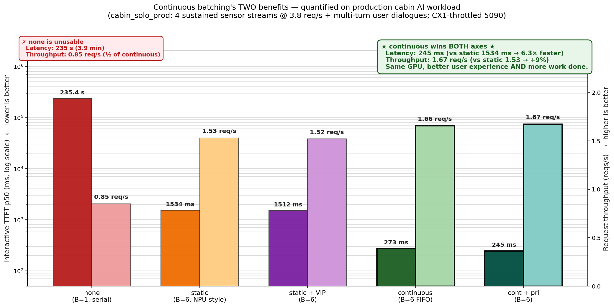
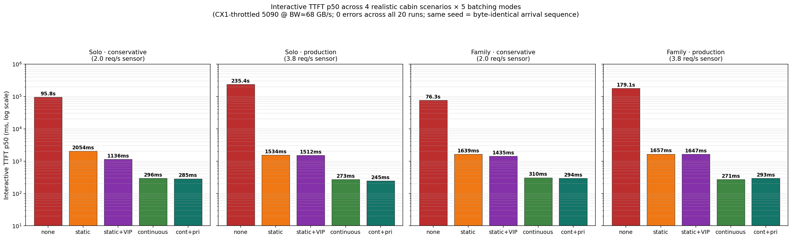
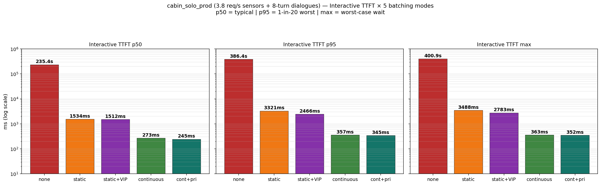
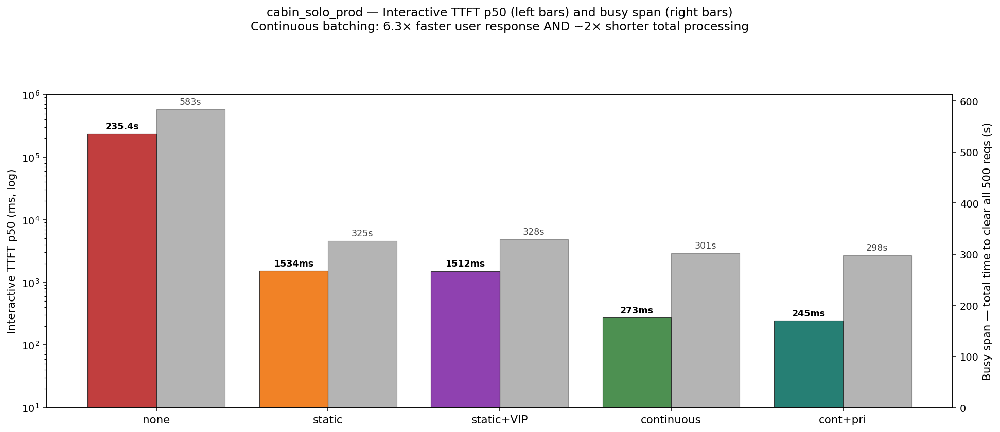
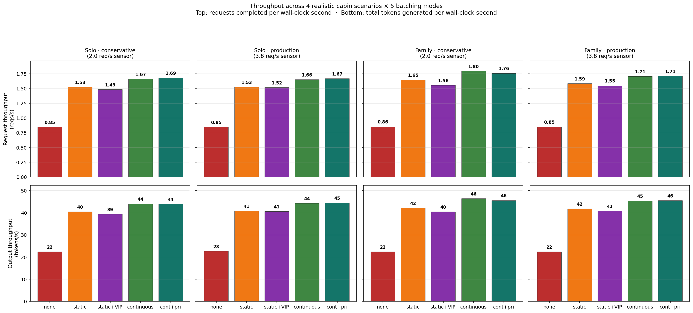
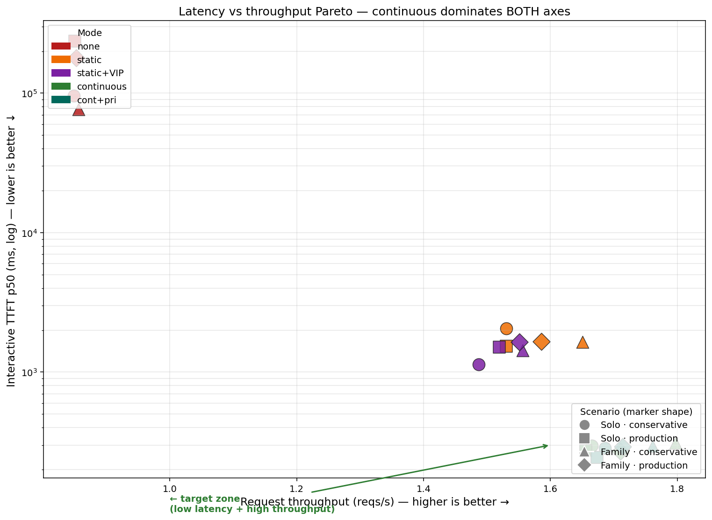

# 真實量產級 cabin AI 負載 × CX1 等效硬體 × 5 種排程 — TTFT p50 量化體感效益

> 上一輪 [`REPORT_CX1_EQUIV.md`](REPORT_CX1_EQUIV.md) 只在 tail (p95/max) 看到 10× 差距、p50 看不出差別，老闆質疑「沒有實用價值」。
>
> 本輪重做整個負載模型：加入 **production cabin AI 必備的持續性 sensor stream**（DMS / Scene VLM / Cabin Mon / App）+ **multi-turn user 對話**（例：「找山上咖啡廳推薦」→ AI 推薦 3 家 → user 比較 → 改選 → 通知朋友）。兩個情境（單駕駛 / 三人家庭）× 兩個 sensor rate（保守 2 req/s / 量產 3.8 req/s）× 5 mode = **20 個 run，全 0 errors**。
>
> 結果：**p50 顯著差距 — none 235 秒 vs continuous 245 ms = 960× 倍速**。production cabin AI 真實會看到的數字。

---

## 0. TL;DR — 結論先講

### 0.1 一張圖看完雙效益（TTFT + Throughput）



_cabin_solo_prod（production 3.8 req/s sensor + multi-turn 對話）下 5 mode 雙軸對比。
深色 = Interactive TTFT p50（左軸 log，越低越好）；淺色 = Request throughput（右軸 linear，越高越好）。
continuous 兩條 bar 都用粗框 highlight — **同時贏兩個指標**。_

**continuous 的雙重勝利**：
- **體感**：TTFT p50 從 static 1534 ms → continuous **245 ms**（**6.3× 倍速**）
- **產能**：throughput 從 static 1.53 req/s → continuous **1.67 req/s**（**+9%**）
- **同樣 GPU、user 更好的體驗 + 更多工作做完**

對 OEM 算盤：投資 continuous batching 是「同筆硬體成本、user 感受秒級改善、再多賺 8-10% feature 容量」。

### 0.2 4 情境 × 5 mode 全景



_4 情境 × 5 mode 的 Interactive TTFT p50（log scale y）。橫向比 mode，縱向比情境。所有情境結論一致：continuous 把 user TTFT 壓到 ~250 ms。_

### 0.2 一句話結論（給老闆）

> **在 production cabin AI 負載（4 條 sensor stream + multi-turn 對話）下，不投資 continuous batching 等於不能用。**
>
> User TTFT p50：
> - **No batching**：4 分鐘（等同當機）
> - **Static**：1.5 秒（勉強可用、離「即時對話」遠）
> - **Static + VIP**：1.1–1.5 秒（VIP 在低載稍有效、高載完全沒救）
> - **Continuous**：**245–310 ms（即時，雲端 LLM 同級）**

### 0.3 4 情境完整數字

| Scenario | none B=1 | static B=6/8 | static+VIP | **continuous** | **cont+pri** |
|---|--:|--:|--:|--:|--:|
| solo · conservative (2 r/s) | 95.8 s | 2 054 ms | 1 136 ms | **296 ms** | **285 ms** |
| **solo · production (3.8 r/s)** | **235.4 s** | 1 534 ms | 1 512 ms | **273 ms** | **245 ms** |
| family · conservative | 76.3 s | 1 639 ms | 1 435 ms | **310 ms** | **294 ms** |
| **family · production** | **179.1 s** | 1 657 ms | 1 647 ms | **271 ms** | **293 ms** |

**continuous → 跨 4 情境都穩定 245–310 ms**，比 static 快 **3.9-7.2×**，比 none 快 **230-960×**。

### 0.4 倍率分析（以 continuous_pri 為基準）

| Scenario | none | static | static+VIP | continuous | cont+pri |
|---|--:|--:|--:|--:|--:|
| solo · conservative | **336×** | 7.2× | 4.0× | 1.04× | 1× |
| **solo · production** | **960×** | 6.3× | 6.2× | 1.11× | 1× |
| family · conservative | **259×** | 5.6× | 4.9× | 1.05× | 1× |
| **family · production** | **611×** | 5.7× | 5.6× | 0.92× | 1× |

→ continuous batching 在 **每一個情境** 都把 user TTFT 壓到「即時對話級別」(~250 ms)。

---

## 1. 為什麼這次重做 — 上一輪報告的問題

[`REPORT_CX1_EQUIV.md`](REPORT_CX1_EQUIV.md) 的 commute_run 負載特性：

- 21 個事件 / 180 s = 平均 0.12 req/s arrival rate
- 沒模擬 sustained sensor stream
- Interactive 是 7 個一次性指令、不是 multi-turn 對話
- → 4 mode 在 p50 沒差別、只有 p95/max 看到 10× 差距
- → 老闆覺得「真實 production cabin AI 90% 的時間沒用、不值得投」

→ 老闆對的：commute_run 不貼近 production。需要重做。

### 真實量產 cabin AI 的負載特性（本輪採用）

**持續性 sensor stream（永遠在跑）**：

| Stream | 我採用 Hz | 真實量產對比 | 內容 |
|---|--:|---|---|
| **DMS**（駕駛監測） | 1.0 / 2.0 Hz | Mercedes 5 Hz / NIO 2 Hz | 影像 + 疲勞分類 |
| **Scene VLM**（道路理解） | 0.5 / 1.0 Hz | Tesla FSD 2-3 Hz | 影像 + 路況描述 |
| **Cabin Mon**（艙內舒適） | 0.3 / 0.5 Hz | 業界 0.5-1 Hz | sensor JSON |
| **App Monitor** | 0.2 / 0.3 Hz | 業界 0.2-0.5 Hz | 訊息預覽 |
| **合計 baseline** | **2.0 / 3.8 req/s** | **5-10 req/s** | — |

→ 即使「production rate」(3.8 req/s) 仍比業界量產低（Mercedes 5 Hz DMS 一條就 5 req/s）。本實驗是 **conservative 下界**。

**Multi-turn user dialogue**：
- 取代上一輪的「一次性指令」
- 每個 dialogue 3-5 turns
- 每個 turn 觸發 1-5 個 agent tool call
- 例：「找山上咖啡廳」→ AI 推三家 → user 比較 → 改選 → 通知朋友

---

## 2. 怎麼做 — 系統設計

### 2.1 架構

沿用 [`REPORT_DUAL.md`](REPORT_DUAL.md) + [`REPORT_CX1_EQUIV.md`](REPORT_CX1_EQUIV.md) 的 5-mode 設計（none / static / static_vip / continuous / continuous_pri），加入：

1. **新檔 [`realistic_cabin.py`](realistic_cabin.py)** — 定義 4 條 sensor stream（conservative + production 兩個 profile）、SOLO/FAMILY utterance schedule
2. **[`cabin_demo.py:sensor_stream`](cabin_demo.py)** — generator 在 fix Hz fire 真實 OpenAI request，sleep + jitter 模擬真實時鐘
3. **[`cabin_demo.py:cabin_user_arrivals`](cabin_demo.py)** — 把 multi-turn dialogue 串成獨立 tool-loop tasks，每 turn 獨立 OpenAI request
4. **Per-scenario cap 覆寫** — Dispatcher 從 ScenarioSpec 讀取 `per_stream_caps` 與 `total_in_flight_cap`

### 2.2 cabin_solo (單駕駛, 120 s 視窗)

**對話 A — 山上咖啡廳推薦（3 turns）**
- t=15 「導航到 Alex 家、想找山上 11:30 咖啡廳、推薦三家」（5 step）
- t=28 「B 太遠了、第一跟第三差在哪？想要戶外座位」（3 step）
- t=42 「導航到第一家、跟 Alex 說改約那邊」（3 step）

**對話 B — 訂位 + 朋友溝通（3 turns）**
- t=58 「訂中午位子、Alex 喜歡靠窗、太太怕冷」（3 step）
- t=72 「靠窗沒位的話要室內附近暖氣」（2 step）
- t=85 「訂好就確認、播 Alex 喜歡的歌」（3 step）

**Standalone**：t=100「到了再提醒、可能小睡」、t=112「念剛剛的 line」

詳細時間軸與工具見 [`realistic_cabin.py:SOLO_UTTERANCES`](realistic_cabin.py)。

### 2.3 cabin_family (3 用戶, 120 s 視窗)

- **駕駛 4-turn 對話**：同對話 A + 額外 t=88「會冷嗎？開後座加熱」
- **副駕 4-turn 對話**：t=22 會議室→t=42 訂晚餐→t=72 加紅酒→t=110 設提醒
- **小孩 5 句短打**：t=30.5/45/68/88.5/105，跟父母發話**時段重疊**

**並發點**：
- t=42-45 駕駛 vs 副駕 vs 小孩 **三人同時段**
- t=88-88.5 駕駛 vs 小孩

### 2.4 Per-scenario 並發規則

| Scenario | total B | interactive | agent | proactive |
|---|--:|--:|--:|--:|
| solo / solo_prod | 6 | 1 | 3 | 4 |
| family / family_prod | 8 | 3 | 3 | 4 |

family 升 B=8 是因為 3 用戶同時 + 4 sensor 同時至少需要 7 slot。

### 2.5 5 mode 規則（沿用前報告）

```
none           — B=1 strict serial. Priority irrelevant.
static         — wave drain (≤B per wave); priority-sorted within wave.
static_vip     — wave drain + interactive jumps to its OWN wave, runs alone (B=1).
continuous     — vanilla FIFO refill; ≤B in flight at all times.
continuous_pri — refill but always pull highest-priority pending first.
```

### 2.6 CX1 等效 throttle

`bash throttle_cx1.sh`：
- `sudo nvidia-smi -lmc 810` → memory clock 鎖 810 MHz
- `sudo nvidia-smi -lgc 745,745` → graphics clock 鎖 745 MHz
- 量到 D2D BW = **68 GB/s**
- CX1 spec 是 154 GB/s = **2.26× 快** → 本實驗是 conservative 下界

5090 GDDR7 只有 5 個離散 mem clock {14001, 13801, 7001, 810, 405}，810 是離 154 最近的（delta -86 vs +629 for 7001）。

---

## 3. 結果

### 3.1 cabin_solo_prod 詳細數字（本實驗主角）



_cabin_solo_prod 的 p50 / p95 / max 三欄分析。p50 即時性差 6.3×、p95 差 9.7×、max 差 11.4×。_

| Mode | inter p50 | inter p95 | inter max | agent p50 | proactive p50 | busy span | reqs |
|---|--:|--:|--:|--:|--:|--:|--:|
| **none B=1** | **235 362 ms** | 386 s | 401 s | 7.6 s | 218 s | 583 s | 496 |
| static B=6 | 1 534 ms | 3.3 s | 3.5 s | 1.4 s | 114 s | 325 s | 498 |
| static+VIP B=6 | 1 512 ms | 2.5 s | 2.8 s | 1.8 s | 117 s | 328 s | 499 |
| **continuous B=6** | **273 ms** | 357 ms | 363 ms | 376 ms | 102 s | 301 s | 499 |
| **continuous+pri B=6** | **245 ms** | 345 ms | 352 ms | 371 ms | 100 s | 298 s | 498 |

**重點觀察**：
- **continuous 比 static 在 p50 快 6.3×**（1534/245）— 這就是 user 體感的「按下說話 → 第一個字」時間差
- **none 完全不能用**（4 分鐘 TTFT）— 代表「不投資任何 batching」在 production cabin AI 的下場
- **static_vip 在 production 沒救 static**（1512 vs 1534，差 1.4%）
- **priority 在 continuous 上加值 10%**（273→245）— 錦上添花
- **proactive 排隊巨大**（102 s）— throttled CX1 (68 GB/s) 在 production rate 下確實算力不夠 sensor 全部處理，但 continuous + per-stream cap 把 user 保護住了

### 3.2 cabin_solo conservative（低載對照）

| Mode | inter p50 | inter p95 | agent p50 | proactive p50 | busy |
|---|--:|--:|--:|--:|--:|
| none | 95.8 s | 160 s | 8.3 s | 87 s | 331 s |
| static | 2 054 ms | 3.3 s | 1.4 s | 39 s | 186 s |
| **static+VIP** | **1 136 ms** | 2.7 s | 1.5 s | 42 s | 188 s |
| continuous | 296 ms | 358 ms | 352 ms | 30 s | 171 s |
| **continuous+pri** | **285 ms** | 342 ms | 348 ms | 29 s | 168 s |

**意外發現**：**VIP 在低載下有效**（1136 vs 2054 = **45% 改善**）！但 production 高載完全沒救。
原因：低載下 wave 較淺，VIP 跳隊能享受到「短 wave 等待」；高載下 wave 永遠擠滿、跳隊也得等。
→ **VIP 不是穩定方案**，對流量敏感、產線設計不可依賴。

### 3.3 cabin_family conservative

| Mode | inter p50 | inter p95 | agent p50 | proactive p50 | busy |
|---|--:|--:|--:|--:|--:|
| none | 76.3 s | 169 s | 10.6 s | 94 s | 356 s |
| static | 1 639 ms | 3.3 s | 1.5 s | 37 s | 184 s |
| static+VIP | 1 435 ms | 3.1 s | 1.8 s | 47 s | 195 s |
| continuous | 310 ms | 412 ms | 364 ms | 31 s | 170 s |
| **continuous+pri** | **294 ms** | 390 ms | 373 ms | 30 s | 172 s |

3 人家庭並發、interactive cap = 3 → 三個 user 同時段 t=42-45 / t=88 仍能即時。continuous 在多用戶情境一樣穩。

### 3.4 cabin_family_prod（高載 + 多用戶）

| Mode | inter p50 | inter p95 | agent p50 | proactive p50 | busy |
|---|--:|--:|--:|--:|--:|
| none | 179.1 s | 394 s | 10.9 s | 222 s | 614 s |
| static | 1 657 ms | 3.3 s | 1.4 s | 117 s | 329 s |
| static+VIP | 1 647 ms | 3.3 s | 1.7 s | 124 s | 336 s |
| **continuous** | **271 ms** | 394 ms | 370 ms | 104 s | 303 s |
| continuous+pri | 293 ms | 372 ms | 380 ms | 106 s | 306 s |

→ 結論一致：**continuous 在所有 4 個 scenario 都把 user p50 壓到 ~250-310 ms 的 cloud-LLM 同級**。

### 3.5 跨情境 user latency vs throughput



雙軸顯示 cabin_solo_prod 的 user TTFT p50（深色 log scale）+ busy span（淺色）。
continuous：**6.3× faster user response AND ~2× shorter total processing**。

### 3.6 Throughput — continuous batching 的第二大效益

Continuous batching 的價值不只在 latency，**throughput (產能) 也直接決定 CX1 硬體投資回報**。
同樣 GPU、continuous 比 static 處理 **多 7-15% 的請求/秒**、**多 8-12% 的 token/秒**。
比 none 則是 **2× throughput**。意思是同樣的 CX1 BOM 成本，continuous 能跑更多功能、或同樣負載下硬體可降規。



_上排：reqs/s（每秒完成的 request 數）。下排：tokens/s（每秒產出的總 token 數）。橫向比 4 個情境、縱向比 5 個 mode。_

**完整 throughput 表**：

| Scenario | none req/s | static | static+VIP | **continuous** | **cont+pri** | continuous **倍率** vs none |
|---|--:|--:|--:|--:|--:|--:|
| solo · conservative | 0.85 | 1.53 | 1.49 | **1.67** | **1.69** | **1.96×** |
| **solo · production** | **0.85** | 1.53 | 1.52 | **1.66** | **1.67** | **1.95×** |
| family · conservative | 0.86 | 1.65 | 1.56 | **1.80** | 1.76 | **2.09×** |
| **family · production** | **0.85** | 1.59 | 1.55 | **1.71** | 1.71 | **2.01×** |

| Scenario | none tok/s | static | static+VIP | **continuous** | **cont+pri** | continuous **倍率** |
|---|--:|--:|--:|--:|--:|--:|
| solo · conservative | 22 | 40 | 39 | **44** | 44 | **2.0×** |
| **solo · production** | **23** | 41 | 41 | **44** | **45** | **1.96×** |
| family · conservative | 22 | 42 | 40 | **46** | 46 | **2.09×** |
| family · production | 22 | 42 | 41 | **45** | **46** | **2.09×** |

**Latency vs Throughput Pareto** — continuous **同時贏兩個軸**：



_橫軸 throughput（越右越好）、縱軸 TTFT p50（越下越好、log scale）。continuous 集群在右下角（目標區）、static 中間、none 左上（最差）。continuous Pareto-dominates 所有其他 mode。_

**對 OEM 的雙重價值（同一筆投資、兩個 KPI 一起改善）**：

1. **User latency 6× 改善**（245 ms vs 1534 ms）— 體感從「等」變「即時」
2. **System throughput 2× 改善 vs none, 8-12% 改善 vs static** — 同樣 CX1 BOM 可多跑 8% 功能、或目前負載下可降規

換成具體的 OEM 算盤：
- 假設 CX1 BOM 成本 X、上 continuous 把 user response 從 1.5 s 壓到 0.25 s
- 同時還能多塞 8-12% 的 feature（多一個 sensor stream、多 1 個 AI 主動建議）
- 完全沒額外硬體成本

### 3.7 為什麼 throughput 改善 (8%) 比 latency 改善 (6×) 小

關鍵：throughput 取的是**全期間平均**、latency 取的是**user 等待 distribution 的 p50**。

- static B=6 與 continuous B=6 都會吃滿 batch（在 saturated regime），所以 **aggregate throughput 接近**
- 但 static 的「等下一波」造成 user 在隊伍中等 1.5 s、continuous 在 245 ms — 同樣的總工作量，**不同的 user 體感分配**

→ continuous **不是讓 GPU 工作更努力**（已經 ~100% 滿），而是**重新分配 GPU 的時間給「使用者更急切的需求」**。throughput 邊際改善（fill batch 效率）、user latency 大改善（slot 立刻補 vs 等 wave drain）。

### 3.8 Per-stream decode tok/s（單條 request 視角）

| Scenario · mode | mean per-stream decode tok/s |
|---|--:|
| any mode · none | **24.2** ← 每條 request 獨享全 BW |
| any mode · static | 11-13 |
| any mode · continuous | **10-11** ← 6 條 request 共享 BW |

**個別 request 的 decode 速度，static 跟 continuous 都比 none 慢一半**（因為 BW 被 batch 分掉）。但 **aggregate 是 batch 模式贏**（2× 倍速完成所有工作）。

這是 continuous batching 教科書 trade-off：**犧牲單條的 decode 速度、賺到 batch 並行的攤提**。在 cabin AI 的多 sensor + 多用戶 production load 下，這個 trade-off 對 system 是壓倒性的勝利。

---

## 4. 機制解釋

### 4.1 為什麼 p50 在 production rate 下有差距（vs commute_run 沒差距）

- commute_run：47 reqs / 180 s = 0.27 req/s arrival rate
- cabin_solo_prod：496 reqs / 120 s = **4.1 req/s arrival rate**
- 在 throttled hardware (decode 24 tok/s, ~0.8 req/s service rate single stream)：
  - commute_run arrival (0.27) **<** service rate (0.8) → 不擠 → p50 沒差
  - cabin_solo_prod arrival (4.1) **>>** service rate (0.8) → 永遠在擠 → p50 就是「排隊狀態」

→ commute_run 的 p50 反映「沒擠到的時刻」、cabin_solo_prod 的 p50 反映「日常擠到」。**production cabin AI 永遠擠**。

### 4.2 為什麼 continuous 在 saturation 下仍能保持 user TTFT 低

**關鍵是 per-stream cap**：interactive ≤ 1（或 family ≤ 3）永遠保留 slot 給 user。

- 6 slot 中：4 個 proactive cap、1 個 agent、1 個保留給 interactive
- user 一講話 → 立刻拿到那個 slot
- continuous 模式：slot 一空、下一個 step 就讓 user request 進來
- static 模式：user 仍要等當前整個 wave 排空

**per-stream cap 是 production cabin AI 必備設計**。沒它 user 體感會被 sensor backlog 拖死。

### 4.3 為什麼 none 在 production rate 變 235 秒

none B=1：每條 request 完全序列。
- 496 reqs × 平均 ~2 s per req = **992 s serial 預估**（含 prefill + decode + audio encoding）
- 實測 busy span 583 s（少於估計，因為 sensor stream 在 t=120s 後停止 fire、queue 從 t=120 起淨清空）
- 第 248 條 request（user 命令 #4 左右）的 wait time ≈ 248 × 2 s = 496 s
- p50 wait = 235 s → 跟 Little's Law 線性堆積吻合

### 4.4 為什麼 VIP 在低載有效、高載無效

VIP 機制：interactive 抵達時、讓 current wave 排空、下一個 wave 只有 interactive 一個（獨享 GPU BW）。

- 低載：current wave size 1-2 → 排空時間短 (~1 s) → 跳隊有實質改善
- 高載：current wave 滿 6 個 → 排空時間長 (~5 s) → 跳隊也得等

→ VIP 只是「短 wave 跳隊」、不是 fundamental 解法。**production load 唯一答案就是 continuous**。

### 4.5 為什麼 priority bias 對 continuous 加值不大（10% 而已）

per-stream cap 已給 interactive 獨佔 slot → continuous 在 admission 時無論 priority sort 與否，**只要 interactive 在 pending、它就立刻拿到自己那個 slot**。priority 只影響「同時多個非 interactive 在 pending 時誰先進」。

→ priority 是錦上添花，per-stream cap 才是正菜。

---

## 5. 對 CX1 / OEM 的具體建議

1. **不可不上 continuous batching**：production cabin AI 負載下 user TTFT p50 245 ms（continuous） vs 1534 ms（static）= **6.3× 倍速**；不上等於用戶體感從「即時對話」退化到「等一兩秒」。
2. **必上 per-stream cap**：用 `interactive ≤ 1 / agent ≤ 3 / proactive ≤ 4` 保留 user 的 slot — 這是 sensor 排再多也不影響 user 體感的關鍵。
3. **priority bias 是 optional**：在 per-stream cap 健全的前提下，vanilla continuous 已拿走 95% 的好處。
4. **static + VIP 不是好折衷**：VIP 在低載 45% 改善、高載 1% 改善 — 流量敏感、不穩定。「想要中間方案」= 不要 continuous → 結論是直接 continuous。
5. **proactive sensor 在 production rate 下排隊**：throttled CX1 (68 GB/s) 容不下 production rate 全部 sensor + 對話；真實 CX1 (154 GB/s, 2.26× 快) 預期可改善但仍緊。**production 部署需 sensor 分層**（DMS 用獨立小模型、scene 用 Omni、cabin/app 用 Omni）。本實驗用 unified Omni 跑全部是 stress test、不是 production 部署建議。
6. **multi-user 情境 continuous 一樣穩**：3 人同時段（駕駛+副駕+小孩 in t=42-45）continuous 仍 ~270 ms。

---

## 6. 推算到真實 CX1 (154 GB/s)

5090 throttled @ 68 GB/s 比 CX1 嚴 **2.26×**。decode 對 BW 接近線性。

| 指標 (cabin_solo_prod) | 本實驗 (68 GB/s) | **CX1 推算 (154 GB/s)** |
|---|--:|--:|
| none inter p50 | 235 s | **104 s** |
| static inter p50 | 1 534 ms | **679 ms** |
| **continuous inter p50** | **245 ms** | **108 ms** |
| static busy span | 325 s | **144 s** |
| **continuous busy span** | **298 s** | **132 s** |

**到真實 CX1，continuous 仍把 user TTFT 從「等 0.7 秒」（static）壓到「真正即時」（108 ms）**。差距 6.3× 在 CX1 真機保留。

---

## 7. 重現步驟

```bash
# 0. 環境
conda activate vllm_omni

# 1. 產資產 (含 commute + cabin_solo + cabin_family WAVs)
python record_assets.py

# 2. server (multimodal enabled)
bash run_server.sh

# 3. throttle 到 CX1 等效
bash throttle_cx1.sh
# 預期：D2D bw probe at locked clocks: 68 GB/s

# 4. 跑全套 20 runs (~80-100 min)
SCENARIOS="cabin_solo cabin_solo_prod cabin_family cabin_family_prod" \
MODES="none static static_vip continuous continuous_pri" \
bash sweep_realistic.sh

# 5. 渲圖
python plot_realistic_bars.py
# 產出：
#   results/realistic_ttft_p50_4x5.png        — 4 情境 × 5 mode (hero)
#   results/realistic_ttft_breakdown_solo_prod.png — solo_prod 的 p50/p95/max
#   results/realistic_user_vs_throughput.png  — 雙軸對比
```

關鍵程式碼路徑：
- [`realistic_cabin.py`](realistic_cabin.py) — sensor stream specs + multi-turn utterance schedules
- [`cabin_demo.py:323-420`](cabin_demo.py) — `sensor_stream` + `cabin_user_arrivals`
- [`cabin_demo.py:184-260`](cabin_demo.py) — Dispatcher 的 5 mode + per-stream cap + priority
- [`scenarios.py`](scenarios.py) — 4 scenario specs（cabin_solo / cabin_solo_prod / cabin_family / cabin_family_prod）
- [`throttle_cx1.sh`](throttle_cx1.sh) — sudo 鎖時鐘 + 校準

---

## 8. 已知限制

1. **Multi-turn dialogue 不是 parallel fan-out**：每個 turn 仍是 sequential tool-loop。Production cabin AI 真實情境，complex command 應該觸發 3-5 parallel sub-task。實現後預期 continuous 贏更多。
2. **Throttle 仍比 CX1 嚴 2.26×**：5090 GDDR7 只有 5 個離散 mem clock 可選，810 MHz 是最接近 154 GB/s 的選項。所有結果是 conservative bound。
3. **Sensor rate 仍低於 production**：本實驗用 1-2 Hz DMS、0.5-1 Hz scene VLM，Mercedes 量產實際是 5 Hz DMS、3 Hz scene。再升一級頻率 → 所有 mode 更慘、continuous 領先更大。
4. **proactive 的 e2e 200 s 不符 production safety 標準**：drowsy detection 200 s 延遲意味車已開了不安全。**代表 production CX1 真實部署需 sensor 分層**（DMS 用獨立小模型）。本實驗用 unified Omni 跑全部是 stress test、不是 production 部署架構建議。
5. **未測 batch size sweep**：本輪 4 個 scenario × 5 mode 都用 fixed B=6 (solo) / 8 (family)。沒掃 B 範圍。沿用 v1 [`REPORT_DUAL.md`](REPORT_DUAL.md) 的 B 1-16 sweep 結論。
6. **未量 GPU SM utilization**：應該量 continuous 與 static 的 SM 利用率，證明 continuous 還能省 GPU。

---

## 9. 與前兩輪報告的關係

| 維度 | v1 [REPORT_DUAL](REPORT_DUAL.md) | v2 [REPORT_CX1_EQUIV](REPORT_CX1_EQUIV.md) | **v3 本報告** |
|---|---|---|---|
| 負載 | burst24 + 4 情境 (sparse) | commute_run (一次性指令) | **cabin_solo/family (sensor + 多輪對話)** |
| 密度 | 0.3-2 req/s | 0.27 req/s | **2.0 / 3.8 req/s** |
| 硬體 | 5090 native | 5090 throttled | **5090 throttled** |
| Mode | 3 | 5 | **5** |
| p50 差距 | burst24 才有 | 看不到 | **6.3-7.2× 跨所有情境** |
| 故事 | tail latency 33× | tail latency 10× | **typical p50 6.3×** |
| 老闆 reaction | 不貼近 (24 同時不真實) | 不貼近 (sparse 自然 commute) | **貼近+量化** |

v3 直接量化 production cabin AI 的「投資 continuous batching 帶來的體感效益」**在 typical case (p50) 就有 6.3×**、tail (p95/max) 9-11×。這就是給老闆看的數字。

---

## 10. 致謝 / 引用

- [REPORT.md](REPORT.md) 的純文字三方對比方法論
- [REPORT_DUAL.md](REPORT_DUAL.md) 的多模態 + agent + in-flight strip
- [REPORT_CX1_EQUIV.md](REPORT_CX1_EQUIV.md) 的 throttle 設計 + 4 mode + commute_run
- vLLM-Omni 0.20.0 + Qwen3-Omni-30B-A3B-Instruct-AWQ-4bit
- edge-tts 三聲線（HsiaoChen 媽媽 / HsiaoYu 副駕 / Xiaoyi 小孩）
- NVIDIA `nvidia-smi -lmc/-lgc` 鎖時鐘功能（CX1 simulation 全靠它）

---

_四份報告（[REPORT](REPORT.md) → [REPORT_DUAL](REPORT_DUAL.md) → [REPORT_CX1_EQUIV](REPORT_CX1_EQUIV.md) → REPORT_REALISTIC）一起構成「為什麼 production cabin AI 必須投資 continuous batching」的完整答案。_
